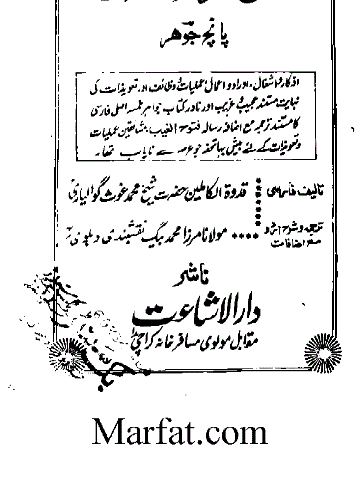
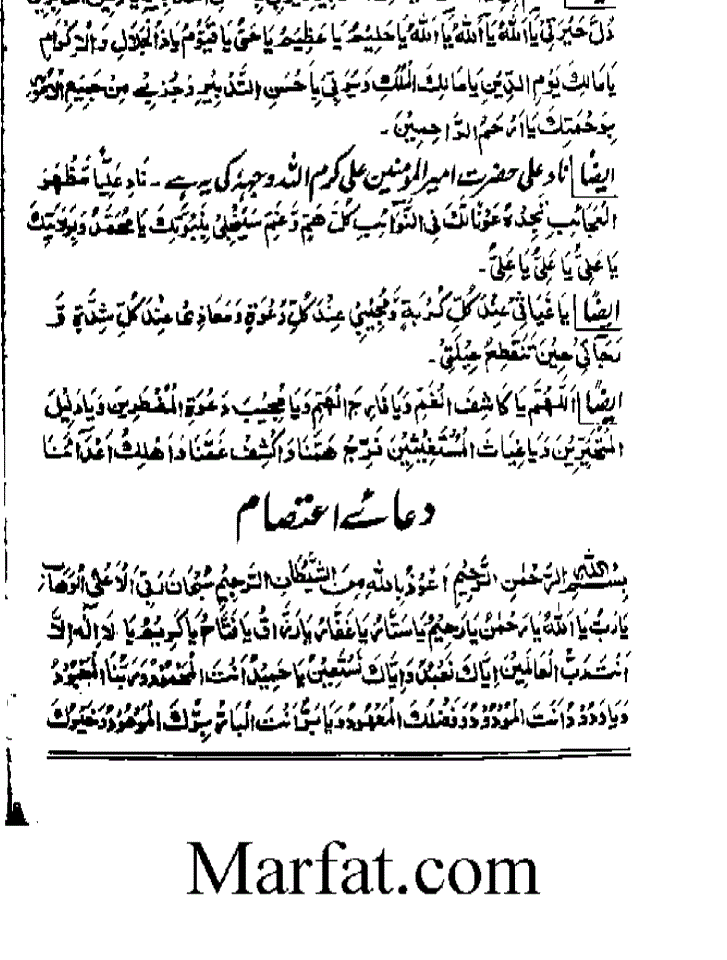
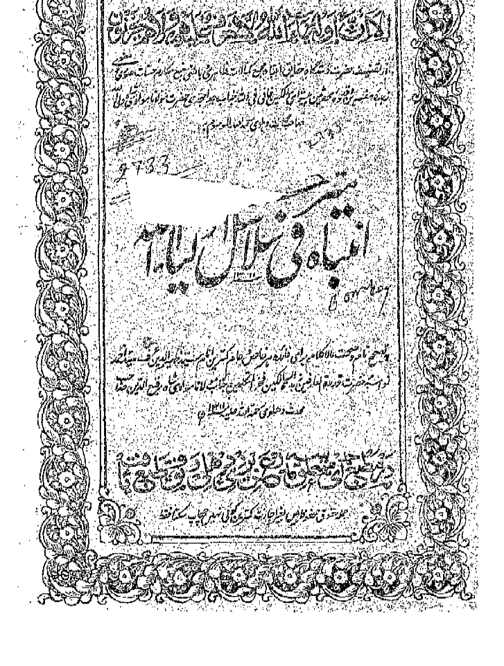
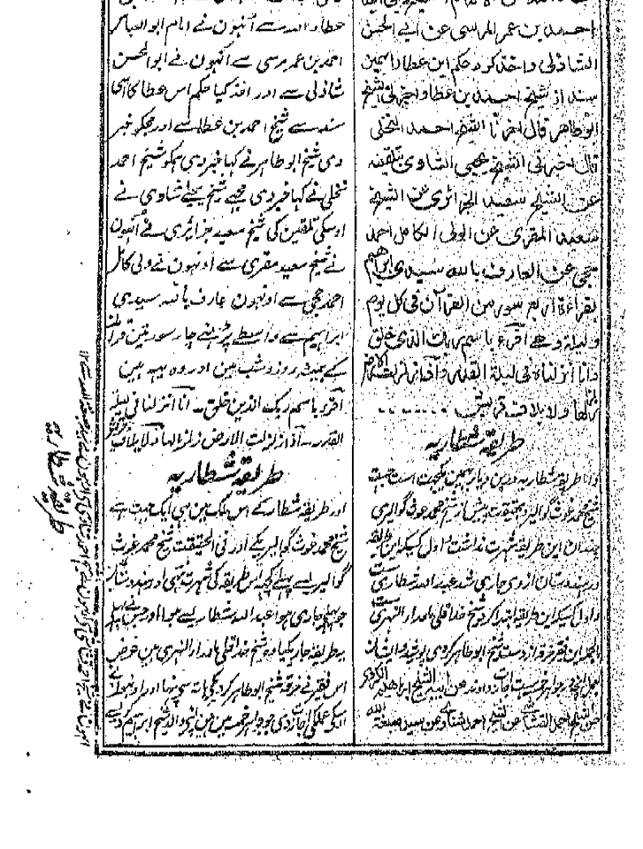
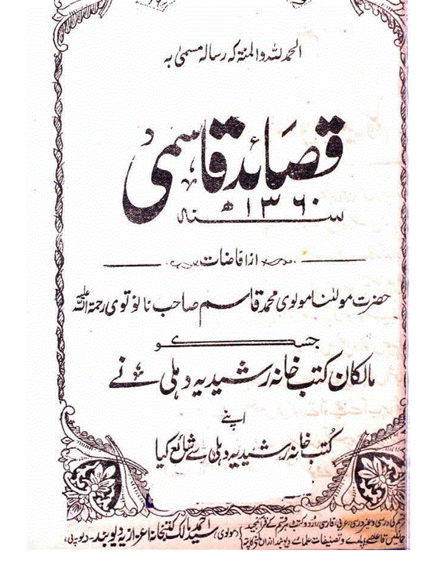
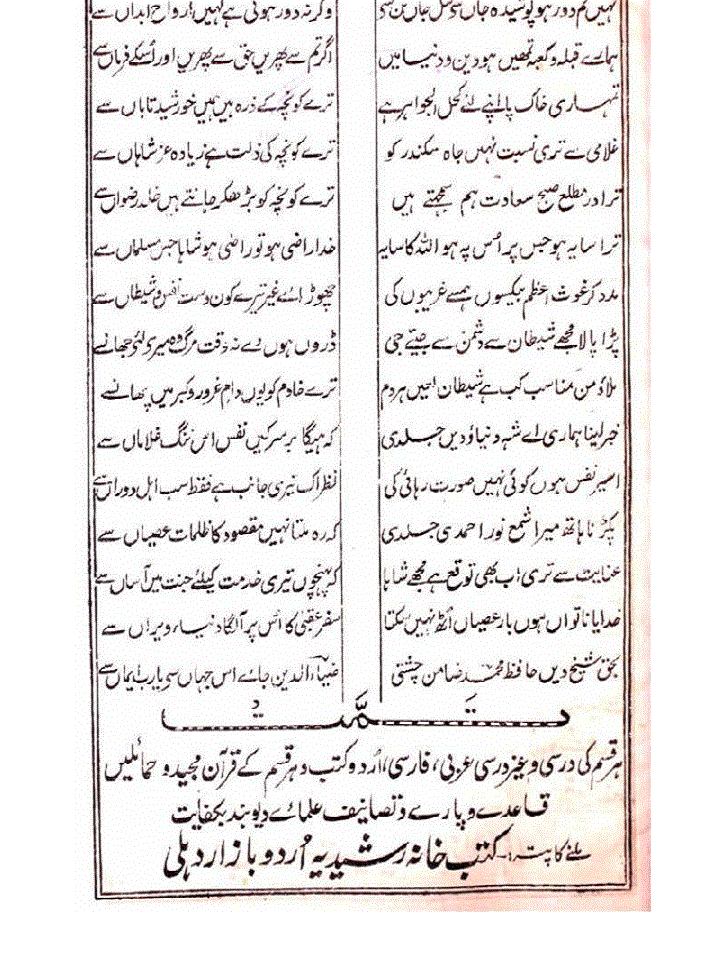

 > بسم اللہ الرحمن الرحیم
 >
 >صلی اللہ علی حبیبہٖ سیدنا محمد وآلہٖ وسلم 

مختصراً عرض ہے کہ حضرت شاہ ولی اللہ محدّث دہلوی رحمہ اللہ علیہ ( متوفی۱۱۷۴ھ/ ۱۷۶۲ء، دہلی ) برصغیر پاک و ہند میں تمام مکاتب فکر کے استاذ الاساتذہ ہیں ، وھابی ، دیوبندی ، بریلوی علماء کی سند حدیث اِن تک پہنچتی ہے ، حضرت شاہ ولی اللہ علیہ الرحمہ کی ایک مشہور  تصنیف ’’انتباہ فی سلاسل اولیاء ‘‘( فارسی زبان میں ہے) ، اس کتاب میں مختلف بزرگوں کی اجازتیں درج ہیں جو کہ حضرت شاہ ولی اللہ محدّث دہلوی علیہ الرحمہ کو ملیں ، اِس میںشیخ محمد غوث گوالیاری علیہ الرحمہ کے سلسلہ شطاریہ کی اجازت بھی درج ہے، اس میں لکھتے ہیں: 

’’  اس فقیر(شاہ ولی اللہ) نے خرقہ شیخ ابو طاہر کردی کے ہاتھ سے پہنا اور انہوں نے اُس کے عمل کی اجازت دی جو جواہر خمسہ میں ہیں ،(انہوں نے) اپنے والد شیخ ابراہیم کردی سے ، انہوں نے شیخ وجیہہ الدین گجراتی سے انہوں نے شیخ محمد غوث گوالیاری سے ‘‘ ۔ 
(انتباہ فی سلاسل ا ولیاء ، مطبوعہ مطبع احمدی دہلی ۱۳۱۱ھ، صفحہ ۱۳۷،۱۳۸) 

حضرت شاہ ولی اللہ کو جواہر خمسہ کے جن اورادکی اجازت ملی اس میں ایک ورد ’’نادعلی‘‘ بھی ہے‘‘ ۔ یہ وِرد درج ذیل ہے۔ 

>’’  ناد علیامظہر العجائب تجدہ عونا لک فی النوائب کل ھم و غم سینجلی بنبوتک یا محمد و بولایتک یا علی یاعلی یاعلی ‘‘ ۔ 
(اصلی جواہر خمسہ، مطبوعہ دارالاشاعت مقابل مولوی مسافر خانہ کراچی،جولائی ۱۹۷۶ء)

ظاہر ہے کہ حضرت شاہ ولی اللہ علیہ الرحمہ کو وظیفہ ناد علی پڑھنے کی اجازت ملی تو آپ یاعلی یاعلی یاعلی بھی کہتے رہے ہوں گے ، سوال یہ پیدا ہوتا ہے کہ یہ ورد بعض لوگوں کے نزدیک ناپسندیدہ اور شرک ہے ، تو کیا حضرت شاہ ولی اللہ محدّث علیہ الرحمہ شرک کا ارتکاب کرتے رہے؟  کیا ایسا کہنا اَب شرک ہے اورنا پسندیدہ ہے تو کیا اُس وقت عین توحید تھا  ؟  

(انتباہ  اور جواہر خمسہ یہ دونوں کتابیں انٹر نیٹ سے ڈائون لوڈ ہوسکتی ہیں) 

## یا غوث  

:::tip
غوث کے معنی ہیں ’’ فریاد رس ‘‘ ۔ 
:::
حقیقی فریاد رس تو اللہ تعالیٰ عزوجل ہے ، اگر آپ خدانخواستہ پانی میں ڈوب رہے ہیں اور کنارے پر کھڑے آدمیوں کو دیکھ کر فریاد کرتے ہیں کہ مجھے بچالو ، تو کیا یہ شرک ہوگا  ؟ 

دیوبندی مکتب فکر ایک ایک بڑے عالم مولانا احتشام الحسن کاندھلوی ،  جن کا ایک رسالہ ’’ مسلمانوں کی پستی کا واحد علاج ‘‘ پہلے تبلیغی نصاب کے آخر میں چھپتا تھا ، اَب غالباً فضائل اعمال کے آخر میں چھپتا ہے ، ورنہ انٹر نیٹ پر موجود ہے ، ڈائون لوڈ ہوسکتا ہے ۔ ان کی ایک کتاب سیدنا شیخ عبدالقادر جیلانی رضی اللہ عنہ کے حالات پر ’’ غوث اعظم ‘‘ کے نام سے ادارہ اسلامیات انار کلی لاہور نے شائع کی ہے ، انٹر نیٹ سے ڈائون لوڈ ہوسکتی ہے۔ 

انہوں نے سیدنا شیخ عبدالقادر جیلانی رضی اللہ عنہ کو ’’ غوث اعظم ‘‘ (بڑا فریاد رس) کہا ہے ،  آج تک کسی نے اِن پر اعتراض کیوں نہیں کیا ؟ 

مولانا محمد قاسم نانوتوی دارالعلوم دیوبند نے ایک کتاب ’’ قصائد قاسمی ‘‘ لکھی ہے ، اس کے صفحہ ۳۹ پر لکھتے ہیں  :    ؎

مدد کر غوث اعظم بے کسوں ہم سے غریبوں کی   
چھڑائے کون غیر تیرے کون دست نفس شیطاں سے

مولانا قاسم نانوتوی نے شیخ عبدالقادر جیلانی علیہ الرحمہ کو غوث اعظم کہہ کر ا ن سے فریاد کی ہے ، آج تک کسی توحید پرست دیوبندی نے اعتراض کیوں نہیں کیا  ؟  صرف اہل سنت سے سوال کیوں کیا جاتا ہے  ؟  یہ کتاب بھی انٹر نیٹ پر موجود ہے ۔ 

احقر آج کل گھریلو کاموں کی مصروفیت کی وجہ سے مختصر لکھ دیا ہے ، یہ سوال نیا نہیں ہے ، بلکہ مدت سے سال ،چھ مہینے بعد دہرایا جاتا ہے، آخر میں ایک حوالہ درج کرکے ختم کرتا ہوں  : 
ؒخلافت فاروقی رضی اللہ عنہ میں ایک سال مدینہ منورہ میں قحط عظیم پڑا ، اس سال کا نام ’’ عام الرمادہ ‘‘ رکھا گیا ، یعنی ہلاکت و تباہی جان و مال کا سال ، حضرت عمر فاروق رضی اللہ عنہ نے حضرت عمر و بن العاص رضی اللہ عنہ کو مصر میں فرمان بھیجا  : 

>’’  سلام  اما بعد فلعمری یا عمرو ! ما تبالی اذا شبعت انت ومن معک انا اھلک انا ومن معی فیا غوثا ہ ! ثم یا غو ثا ہ یرددقولہ  ‘‘ ۔ 

( سلام کے بعد واضح ہو مجھے اپنی جان کی قسم ! اے عمرو ! جب تم اور تمہارے ملک والے سیر ہوں تو تمہیں کچھ پرواہ نہیں کہ میں اور میرے ملک والے ہلاک ہو جائیں اے فریا دکو پہنچ  اے فریاد کو پہنچ ۔) 

حضرت عمرو بن عاص رضی اللہ عنہ نے جواب میں اناج کے لدے ہوئے اتنے اونٹ بھیجے کہ پہلا اونٹ مدینہ منورہ میں پہنچا تو ابھی آخری اونٹ مصر میں تھا ۔ مختصراً 

یہ حوالہ درج ذیل کتابوں میں موجود ہے ،

 یہ کتابیں انٹر نیٹ سے ڈائون لوڈ ہو سکتی ہیں۔

## حوالہ جات اور عکس

۱۔  المستدرک حاکم ، مطبوعہ دارالکتب العلمیہ بیروت ، جلد اوّل، ص ۵۶۳۔ 

۲۔  صحیح ابن خزیمہ ،مطبوعہ المکتبۃ الاسلامی،جلد ۴، ص ۶۸

۳۔   کنزالعمال ، علی متقی ، مطبوعہ موسسۃ الرسا  لۃ، جلد ۱۲ ، ۶۱۴،۶۱۵، ۶۱۰

۴۔   طبقات ابن سعد ، مطبوعہ المکتبۃ الخانجی، جلد ۳ ، ص ۲۸۹

۵۔   سنن الکبریٰ ، امام بیہقی ، مطبوعہ دارالکتب العلمیہ بیروت ،جلد۶، ص۵۷۷

