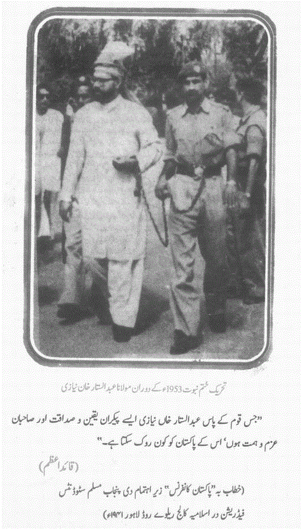
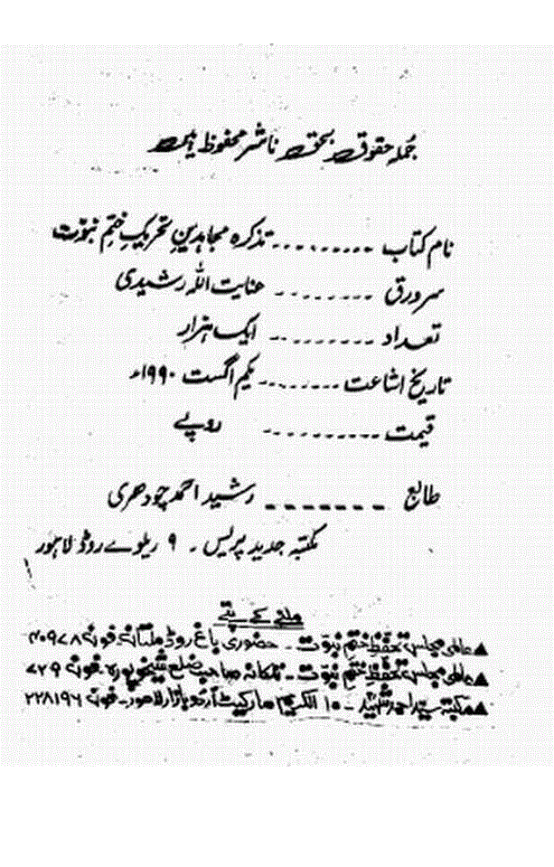
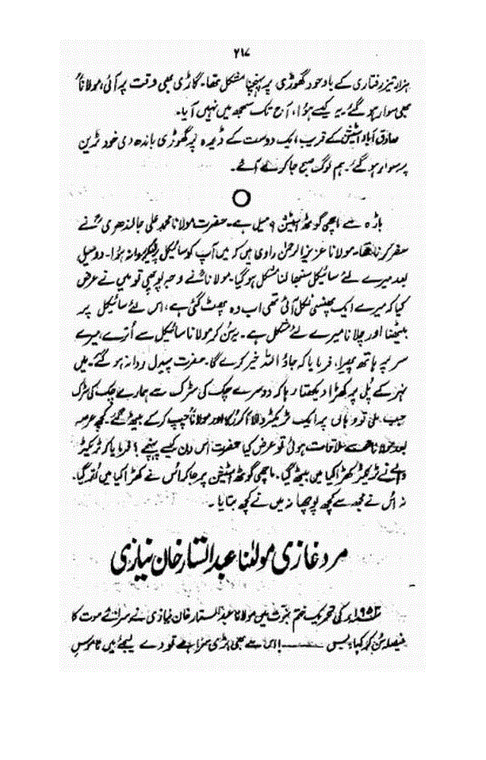
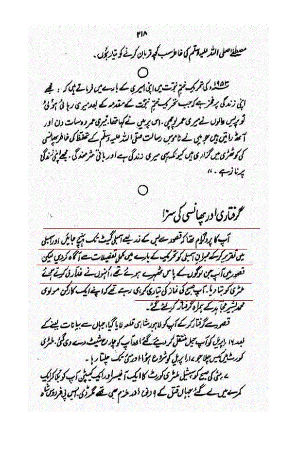
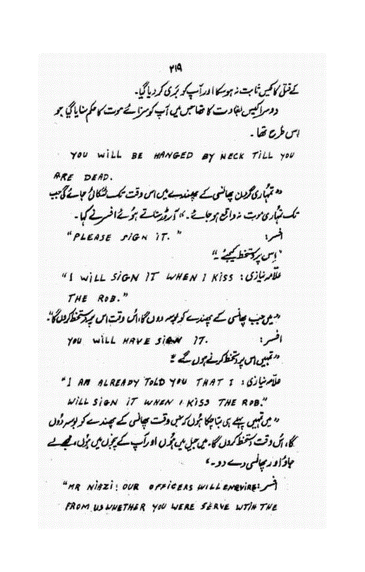
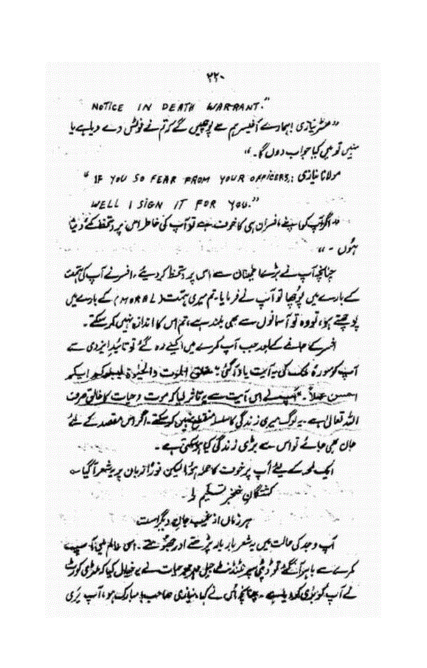
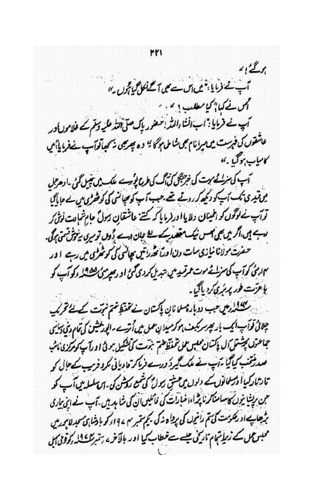

> اََلْحَمْدُ لِلّٰہِ رَبِّ الْعٰلَمِیْنَ وَ الصَّلٰوۃُ وَالسَّلَامُ عَلٰی سَیِّدِ الْمُرْسَلِیْنَ
> اََمَّا بَعْدُ فَاَعُوْذُ بِاللّٰہِ مِنَ الشَّیْطٰنِ الرَّجِیْمِ ط بِسْمِِ اللّٰہِ الرَّحمٰنِ الرَّ حِیْمِِ ط

مجاہد ملت مولانا عبدالستار خاں نیازی رحمۃ اﷲ علیہ کی ذات محتاج تعارف ہے اور نہ ان کے بے نظیر کارنامے محتاج بیان ہیں، موصوف حکیم الامت علامہ محمد اقبال علیہ الرحمہ کے تلمیذ رشید ، بانی پاکستان قائد اعظم کے معتمد ساتھی اور عالم اسلام کے مایہ ناز مذہبی وسیاسی راہنما ہیں، ان کی زندگی ایک کھلی ہوئی کتاب کی مانند ہے، تحریک ختم نبوت ۱۹۵۳ء میں آپ کا مجاہدانہ کردار تاریخ کے صفحات میں محفوظ ہوچکا ہے، سوائے اُس وقت کی حکومت اور بعد کے بعض جہلاء دیوبند کے علاوہ تمام مذہبی وسیاسی جماعتوں کے اکابرین نے اس تحریک میں آپ کے کردار کی تعریف کی ہے۔

علماء حق پر الزامات لگتے رہے ہیں اور لگتے ہی رہیں گے ، اسی طرح جہلاء دیوبند نے مجاہد ملت علیہ الرحمہ پر بھی یہ الزام لگایا گیا آپ تحریک ختم نبوت ۱۹۵۳ء میں داڑھی منڈوا کر تحریک سے فرار ہوئے گئے تھے، اس جھوٹے الزام کے بارے میں عرض ہے کہ آپ نے ۱۹۴۲ء میں داڑھی رکھی ،۱۹۵۳ء میںآپ رکن صوبائی اسمبلی پنجاب تھے، ۱۹۵۳ء میں تحریک کے دوران یہ طے پایا کہ آپ کو اسمبلی کے اجلاس میں جاکر اس تحریک کی اصل صورت حال بیان کرنی چاہئے، چنانچہ مجاہد تحریک ختم نبوت مولانا خلیل احمد قادری ابن مولانا ابوالحسنات محمد احمد قادری، صدر تحریک ختم نبوت ۱۹۵۳ء اس واقعہ کا تذکرہ کرتے ہوئے بیان کرتے ہیں : (دیوبندی تنظیم عالمی مجلس تحفظ ختم نبوت (ملتان)کے مولانا اﷲ وسایا نے اپنی کتاب ’’تذکرہ مجاہدین ختم نبوت‘‘ کے صفحہ ۱۴۴ پرمولانا خلیل احمد قادری کا تذکرہ بھی کیا ہے)

## الزام کی حقیقت

:::tip
’’۶؍ مارچ کو جنرل اعظم کی قیادت میں مارشل لاء نافذ کردیا گیا، یہ مارشل لاء انتہائی سخت تھا اور ریڈیو سے دھمکی آمیز اعلانات نشر ہورہے تھے، دن کے بارہ بجے ریڈیو پاکستان سے اعلان ہوا ’’مولانا عبدالستار خاں نیازی اور مولانا خلیل احمد قادری اپنے آپ کو گرفتاری کے لئے پیش کردیں ورنہ انہیں دیکھتے ہی گولی ماردی جائے گی‘‘ مولانا عبدالستار خان نیازی اس وقت صوبائی اسمبلی کے ممبر تھے اور ہماری خواہش تھی کہ وہ اس مسئلہ پر اسمبلی میں تقریر کریں، اسمبلی کا اجلاس چند روز میں ہی شروع ہونے والا تھا، چنانچہ ہم نے مولانا عبدالستار نیازی خاں کو مشورہ دیا کہ وہ اپنے آپ کو کسی محفوظ مقام پر پہنچادیں، مولانا نیازی نے اس تجویز سے اتفاق کیا ، مولانا نیازی چند افراد کے ہمراہ مسجد کے مغربی اور جنوبی مینارہ سے متصل مکان میں منتقل ہوئے اور پھر دیہاتیوں کا سا لباس پہن کر لاہور سے باہر چلے گئے، اس موقع پر تحریک دشمن عناصر نے یہ افواہیں پھیلا ئیں کہ مولانا نیازی دیگ میں بیٹھ کر گئے ہیں اور یہ کہ انہوں نے داڑھی منڈوالی ہے، یہ افواہیں صرف تحریک کو ناکام بنانے کے لئے پھیلائی گئیں اور پولیس نے اپنی خفت مٹانے کے لئے انہیں ہوا دی حالانکہ ان باتوں کا حقیقت سے کوئی تعلق نہیں تھا ‘‘۔
:::
اس موقع پر پولیس نے نیازی صاحب اورآپ کے دوست مسلم لیگ اور تحریک پاکستان کے کارکن حکیم محمد انور بابری مرحوم،لاہور(متوفی ۱۹۷۲ء)کے گھروں کی تلاشی کے دواران آپ کی طالب علمی کے زمانے تصاویر حاصل کیں اور انگریزی اخبار میں چھاپ دی، اس واقعہ کے دوران آپ کو قصور سے گرفتار کرکے لاہور لایا گیا، تھانوں اور عدالتوں میں پیش کئے گئے، اس وقت کی اصل تصویر ہم اس مضمون کے آخر میں شائع کررہے ہیں، جس تصویر کو جہلاء دیوبند کی طرف سے شائع کرنے کی بات کی جاتی ہے، وہ تصویر بھی ہم نیچے شائع کررہے ہیں،اب حقیقت حال سنئے، حکیم محمد انور بابری اپنے مضمون’’مولانا عبدالستار نیازی، واقعات کا سلسلہ‘‘میں لکھتے ہیں :

۱۹۵۳ء میں ’’تحریک تحفظ ختم نبوت‘‘ میں اہم کردار ادا کیا مجلس عمل کے اراکین کراچی میں گرفتار ہوئے تو لاہور میں تحریک ڈبڈبانے لگی، نیازی صاحب اس وقت ڈٹ کر سامنے آئے اور مسجد وزیر خاں میں زبردست تقریر کی اس سے پانسہ پلٹ گیااور دوسرے روز شہریوں کا ہجوم ’’تحریک ختم نبوت‘‘ میں شامل ہوکرخود کو گرفتاری کے لئے پیش کرنے کی خاطر گورنر ہائوس اور وزیر اعلیٰ ممتاز دولتانہ کی کوٹھی پر اُمڈ آیا، فردوس شاہ نامی ایک ڈی ایس پی پولیس کی بھاری نفری کے ساتھ قابو پانے کے لئے آیا، کسی نے ہجوم کو بتادیا کہ اس ظالم نے قرآن مجید کو ٹھوکریں ماری ہیں، اس پر ہجوم کے بپھرے ہوئے نوجوان خنجر لے کر ڈی ایس پی پر حملہ آوار ہوئے اور سے موت کے گھاٹ اتار دیا۔

کہتے ہیں فردوس شاہ کے قتل کی خبر دولتانہ صاحب کو پہنچی تو انہوں نے اپنے سیکرٹری ذاکر قریشی کو اس قتل کیس میں مولانا نیازی کو بھی دھر لینے کا حکم دیا، اس دوران پانچ مارچ کو مار شل لاء کے نفاذ کا اعلان کردیا گیا، پولیس نیازی صاحب کی تلاش میں تھی، انہوں نے خود کو گرفتاری کے لئے پیش کرنا چاہا مگر احباب نے انہیں یہ کہہ کر روک لیا کہ جب تک ۹مارچ کو پنجاب اسمبلی میں تقریر نہیں کرلیتے گرفتاری مفید نہیں ، بعد میں اجلاس ملتوی کردیا گیا ، نیازی صاحب پہلے تو لاہور میں ہی کسی جگہ ٹھہرے تھے پھر احباب نے فیصلہ کیا کہ انہیں یہاں سے منتقل کردیا جائے، چنانچہ آپ کو قصور لے جایا گیا، اس وقت لاہور شہر کے چاروں طرف فوج کا گھیرا تھا، فوج اور پولیس ہر آنے جانے والے کی تصویر لیتی، مگر مولانا نیازی کسی نہ کسی طرح اس گھیرے میں بخیر وعافیت گزر جانے میں کامیاب ہو چکے تھے، یہ پولیس کے لئے بدنامی کا باعث تھا، پولیس نے خفت مٹانے کے لئے میرے مکان سے نیازی صاحب کی زمانہ طالب علمی کی ایک تصویر برآمد کی (نیازی صاحب ۱۹۴۲ء تک داڑھی منڈواتے تھے) اور یہ کہہ کر اخبارات میں شائع کروادی کہ نیازی داڑھی منڈوا کر نکل بھاگا ہے، بدقسمتی سے اب بھی کئی لوگ پولیس کی اس مکروہ حرکت کو صداقت کا نام دیتے ہیں، قصور میں نیازی صاحب گرفتار ہوئے تو بغاوت اور فردوس شاہ کے قتل کے الزامات میں مقدمے چلے، بغاوت کے مقدمے میں مارشل لاء نے آپ کو بری کردیا مگر فردوس شاہ کے قتل کے جرم میں آپ کو سزائے موت سنا دی گئی، جو بعد میں عمر قید میں تبدیل ہوئی اور دوسال ایک ماہ بعد کالعدم ہوئی‘‘۔ (محمد صادق قصوری، نذر مجاہد ملت۔ مطبوعہ زاویہ پبلیشرزلاہور۲۰۰۴ء، ص۸۰، ۸۱، بحوالہ ہفت روزہ زندگی لاہو، بابت ۲۰ نومبر ۱۹۷۲ء)

## مولانا نیازی علماء دیوبند کی نظر میں

### سید عطاء اﷲ شاہ بخاری (سابق صدر مجلس احرار ہند)

’’تحفظ ختم نبوت کی جدوجہد میں ہماری ساری زندگی گزر گئی، ہماری ڈاڑھیاں سفید ہوگئیں، لیکن ناموس مصطفیٰ ﷺ لے لئے دارورسن کی منزل تک پہنچنے کا جو مقام مولانا عبدالستار خاں نیازی کو حاصل ہوا وہ کسی دوسرے کو نہ مل سکا‘‘۔

(مجاہد ملت اور تحریک ختم نبوت، از محمد صادق قصوری ، مطبوعہ مجاہد ملت فائونڈیشن ، (برج کلاں)قصور۲۰۰۴ء ، ص۱۸، بحوالہ مضمون عطاء اﷲ خاں درانی، رکن مجلس احرار و تحفظ ختم نبوت، میانوالی، مطبوعہ ہفت روزہ ’’اُفق‘‘ کراچی، بابت ۸؍ نومبر ۱۹۷۸ء)

### مولانامجاہد الحسینی (گوجرانوالہ)

’’مولانا عبدالستار خاں نیازی کو چونکہ مارشل لاء کے تحت قید بامشقت کی سزا سنائی گئی تھی اس لئے ارباب جیل نے اُن کو چرخے پر سوت کاتنے کی مشقت دی تھی، مولانا ایک روز مشقت فرمارہے تھے کہ سپرنٹنڈنٹ جیل شیخ اکرم صاحب اپنے دوسرے جیل حکام کے ساتھ آدھمکے، نیازی صاحب بے ہنگم روئی تھامے موٹاموٹا کات رہے تھے، شیخ صاحب نے انہیں اس حالت میں دیکھ کر ذرا تحکمانہ لہجہ میں پوچھا!

آپ موٹا کات رہے ہیں نیازی صاحب!  
ہاں جناب ! تاکہ تمہاری سمجھ میں آجائے‘‘۔

(خطبات امیر شریعت، حصہ اوّل ، مرتبہ مجاہد الحسینی، مطبوعہ فیصل آباد ۱۹۸۴ء ، ص۴۲، ۴۳)

### مولانا تاج محمود دیوبندی فیصل آباد

’’ قلعہ کی اسیری کی ابتدائی راتیں بڑی ہولناک ہوتی ہیں، مگر خوش قسمتی سے پہلی ہی رات میری کوٹھڑی کی سنگین دیواروں سے ایک گرج دار آواز ٹکرائی، میں نے یہ آواز پہچان لی، مولانا عبدالستار خاں نیازی اپنی پاٹ دار آواز میں مولانا روم کا یہ شعر پڑھ رہے تھے !

> شاد باش اے عشق خوش سودائے ما
> 
> اے طبیب جملہ علت ہائے ما

(اقبال فیروز کا مضمون’’مولانا تاج محمود‘‘ مطبوعہ روز نامہ نوائے وقت لاہور، ۲۰؍ جنوری ۱۹۸۵ء ص۱۱)

### شورش کاشمیری لاہور

’’واضح رہے کہ مسجد وزیر خاں لاہور کے مورچہ کی پاداش میں مولانا عبدالستار خاں نیازی جو بریلوی مکتبہ فکر کے جید ومعتبر عالم دین تھے، مارشل لاء کی عدالت سے پھانسی کے مستحق گردانے گئے، انہیں سزائے موت سنائی گئی، جو عمر قید میں تبدیل کر دی گئی، انہوں نے اپنی رہائی کے بعد ختم نبوت کے تقریری محاذ کو ٹھنڈا نہ ہونے دیا، اس سلسلہ میں تحریک ومسئلہ سے متعلق دو یا تین کتابچے لکھے، حقیقت یہ ہے کہ مولانا عبدالستار خاں نیازی عشق رسالت ﷺ میں قرن اوّل کے مسلمانوں کا مزاج رکھتے تھے، انہوں نے باہر آتے ہی مرزائی امت کو للکارنا شروع کیا۔

ایوب خاں کے دور میں اُس حکومت کو آڑے ہاتھوں لیا، اُن مسلمانوں کو اینگلو مسلمان کا لقب دیا جو قادیانی امت کو مسلمانوں میں شمار کرتے اور عقیدہ ختم نبوت کی اساس سے ناواقف تھے، مولانا عبدالستار خاں نیازی اس دوران میں دو چار دفعہ پکڑے گئے ، حتیٰ کہ ایوبی غنڈوں اور قادیانی اجیروں نے تنہا پاکر اُن پر حملہ بھی کیا، مرزائیوں کے حوصلے اتنے بڑھ چکے تھے کہ انہوں نے علماء کا استخاف اپنا شعار بنا لیا اور ایوب خاں کو بھی اسی راستہ پر لگالیا‘‘۔
( ’’تحریک ختم نبوت‘‘ از شورش کاشمیری، مطبوعہ لاہور ۱۹۷۶ء، ص۱۶۵)

دیوبندی تنظیم ’’عالمی مجلس تحفظ ختم نبوت ‘‘ کی طرف سے شائع ہونے والی کتاب’’تذکرہ مجاھدین ختم نبوت‘‘ میں مولانا نیازی کا تذکرہ بھی ہے ، مگرکسی بھی دیوبندی نے اس داڑھی والے جھوٹے واقعہ کا ذکر نہیں کیا۔

آخر میں دیکھئے ۱۹۵۳ء کی اصل اور جعلی تصویر جو کہ ایک ساتھ شائع ہوئی تھیں۔ اس کے بعد ۱۹۵۳ء میں گرفتاری کے وقت کی اصل تصویر بھی دیکھئے جو کہ صادق قصوری صاحب کی کتاب’’مجاہد ملت، جلد دوم ، مطبوعہ عمیر پبلشرزاُردو بازار لاہور۱۹۹۷ء کے ٹائیٹل کے آخری صفحہ پر شائع ہو چکی ہے۔ کسی نے سچ کہا جھوٹ کے پائوں نہیں ہوتے۔

