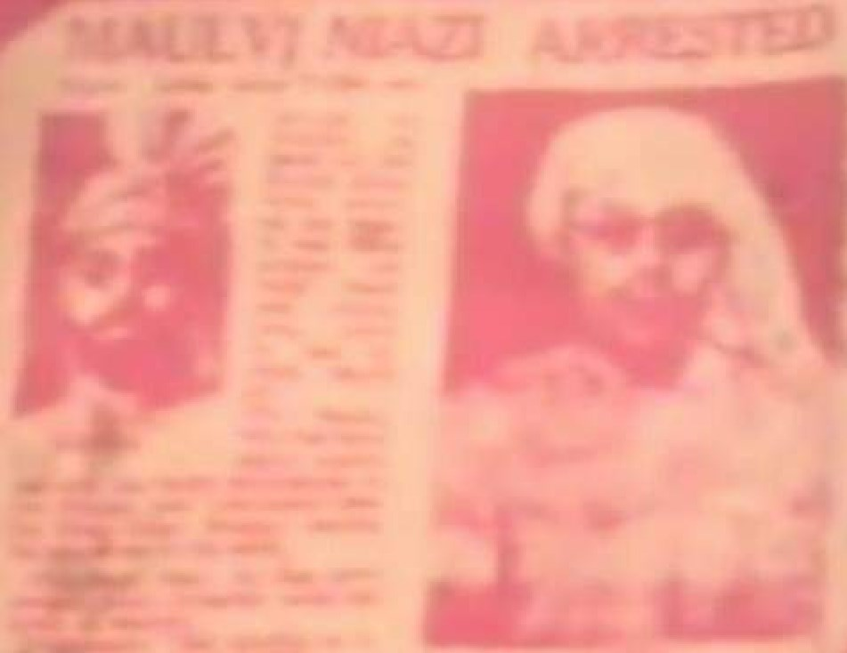
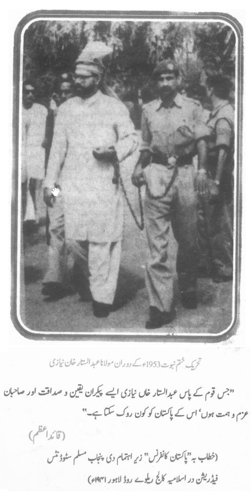

## عرضِ حال

آج سے تقریباً سنتالیس سال قبل طلبہ تنظیم اے ، ٹی ، آئی کے ہمارے دوست جناب قاری عطا اللہ صاحب مدظلہٗ ،فیصل آبادسے ایک رسالہ ’’ ماہنامہ فیضان‘‘ نکالتے تھے ، انہوں نے اس رسالہ کے شمارہ اگست ۱۹۷۸ء؁ اور شمارہ ستمبر، اکتوبر۱۹۷۸ء ؁کے دو شماروں میں جناب شفقت عثمانی صاحب کا ایک مفصل مضمون ’’ جب مجھے سزائے موت سنائی گئی ، تحریک ختم نبوت ۱۹۵۳ء کی لمحہ بہ لمحہ اور لحظہ بہ لحظہ داستان ‘‘ انٹر ویو مولانا سیّد خلیل احمد قادری (متوفی ۲۷؍مارچ ۱۹۹۸ء )شائع کیا تھا ، جناب قاری عطاء اللہ صاحب اور ادارہ نے اس ا نٹر ویو کی آخری قسط میں یہ اعلان کیا تھا کہ ’’ مکمل انٹر ویو  اِن شاء اللہ کتابی شکل میں عنقریب ’’ فیضان پبلی کیشنز‘‘ کی طرف سے شائع کر دیا جائے گا۔ 

لیکن بعد میںماہنامہ ’’ فیضان‘‘ ( فیصل آباد ) کے ایڈیٹر محترم جناب قاری عطا اللہ صاحب نے کینیڈا کی شہریت اختیار کرلی، اور یہ انٹرویو کتابی شکل میں شائع ہونے سے رہ گیا ، آج سے تقریباً ۲۵ سال قبل احقر نے اس انٹرویو کی قسطیں تلاش کرکے اِسے کمپوز کیا تھا۔ 

چند دن پہلے احقر کو حضرت استاذی حکیم محمد موسیٰ امرتسری رحمۃ اللہ علیہ ( متوفی ۱۹۹۹ء) کی ایک بات یاد آئی کہ۱۹۸۲ء میں احقر کی مرتب کردہ کتاب ’’ انوار قطب مدینہ‘‘ (حالات قطب مدینہ شیخ ضیاء الدین احمد قادری ضیائی مہاجر مدنی قدس سرہٗ ( متوفی ۱۹۸۱ء) چھپنے کا مرحلہ آیا تو محترم جناب قاری عطا اللہ صاحب نے مرکزی مجلس رضا لاہور کو اس کی طباعت کے لئے تعاون فرمایا تھا ، اور ۵۰۰ صفحات کی یہ کتاب منظر عام آئی تھی ۔

اس لئے خیال آیا کہ کیوں نہ فقیر بھی قاری صاحب کی اس تمنا کی اشاعت کے لئے  قاری صاحب کے مخلص دوست حضرت میاں زبیر احمد قادری ضیائی مدظلہ لاہور کو اس اشاعت کے لئے عرض کیا جائے۔  

آج سے تقریباً بیس سال پہلے انٹر نیٹ پرایک فورم ’’اسلامی محفل‘‘میں کسی ممبر نے یہ جھوٹ لکھا کہ ۱۹۵۳ء کی تحریک ختم نبوت میں مولانا عبدالستار خان نیازی علیہ الرحمہ گرفتاری سے قبل داڑھی منڈوا کر مسجد وزیر خاں لاہور سے قصور فرار ہوئے تھے، اِس جھوٹے الزام کی تردید ثبوت کے ساتھ آخر میں درج کر دی گئی ہے۔
 **فقیر خلیل احمد رانا**  

## جب مجھے سزائے موت سُنائی گئی
### انٹرویو۔ مولا نا سیّد خلیل احمد قاد ری

## تعارف

امین الحسنات مولانا سیّدخلیل احمد قادری، مفسر قرآن حضرت مولانا ابوالحسنات سیّد احمد قادری رحمۃ اﷲ علیہ ابن مولاناسیّد دیدار علی الوری محدّث لاہوری علیہ الرحمہ(خلیفہ مجاز امام احمد رضا خاں قادری بریلوی قدس سرہٗ) کے اکلوتے فرزند ارجمند اور اپنے والد محترم کی رحلت کے بعد تادم حیات تاریخی مسجد وزیر خاں(لاہور) کے خطیب رہے، مرکزی دارالعلوم حزب الاحناف لاہور سے دستار فضیلت حاصل کی اور طب وحکمت میں اپنے والد ماجد کے مخصوص نسخوں اور طریق علاج کے امین رہے، آپ نے جوانی کے دور میں دینی تحریکوں میں حصہ لیا، ’’تحریک ختم نبوت۱۹۵۳ء‘‘ میں ایک مجاہد کی حیثیت سے جلوہ گر ہوئے، گرفتار ہوئے، لاہور کے قلعہ کے عقوبت خانہ میں رہے ، مارشل لاء نے انہیں سزائے موت کا حکم سنایا مگر ثابت قدم رہے، تحریک ختم نبوت میں ایک طویل عرصہ تک پسِ دیوار زنداں رہے، لاہور میں مسجد وزیر خاں کے پاس’’جامعہ حسنات العلوم‘‘ قائم کیا، مسجد کی خطابت کو تادم زیست اپنایا، اپنے والد مکرم کی تفسیرقرآن ’’تفسیرالحسنات‘‘ کے آخری حصوں کو مکمل کیا اور انہیں چھپوایا، مولانا امین الحسنات سیّد محمد خلیل احمد قادری اشرفی خطیب جامع مسجد وزیر خاں لاہور و امیر جامعہ حسنات العلوم کا ایک کتابچہ ’’عید الضحیٰ مع احکام ومسائل قربانی‘‘مطبوعہ لاہور ، سن طباعت درج نہیں ، صفحات ۴۴، راقم الحروف کی نظر سے گزرا ہے، مجاہد تحریک ختم نبوت مولاناسیّد خلیل احمدقادری اشرفی نے ۲۷؍ ذیقعد ۱۴۱۸ھ/ ۲۷؍مارچ ۱۹۹۸ء بروز جمعہ لاہور میں وفات پائی ۔  

دیوبندی تنظیم عالمی مجلس تحفظ ختم نبوت ( ملتان) سے شائع شدہ کتاب ’’ تذکرہ مجاہدین ختم نبوت‘‘ ۱۹۹۰ء کے صفحہ ۱۴۴ تا ۱۴۷ پر مولاناسیّد خلیل احمد قادری علیہ الرحمہ کے حالات درج ہیں ۔ 

**خلیل احمد رانا**

مجاہد تحریک ختم نبوت امین الحسنات مولانا سیّدخلیل احمد قادری علیہ الرحمہ بیان کرتے ہیں  :

۱۹۵۱ء کے اواخر ہی میں مرزائیوں کے اخبار’’الفضل‘‘ (ربوہ) نے محمود بشیر کی نہایت اشتعال انگیز تقریروں کی اشاعت کا سلسلہ شروع کردیا تھا، سر ظفر اﷲ کے وزیر ہونے کے باعث مرزائی اپنے آپ کو بہت زیادہ طاقتور تصور کرنے لگے تھے اور وہ غالباً اس زعم میں بھی مبتلا ہوچکے تھے کہ پاکستان میں ان کے ناپاک عزائم کا مقابلہ کرنے کے لئے کوئی مؤثر قوت موجود نہیں ہے، چنانچہ ’’الفضل‘‘ نے سرخیاں جمائیں’’جب تک اپنے دشمنوں کو قدموں پر نہ جھکالو چین سے نہ بیٹھو ،  ہمارے پاس عسکری قوت موجود ہے‘‘  ، ۱۹۵۳ء گزرنے نہ پائے گا کہ ہم اپنے مخالفین کو مجبور کردیں گے کہ وہ ہمارے قدموں پر آکر گریں‘‘ وغیرہ  وغیرہ ۔

اِن اشتعال انگیز تحر یروں سے مسلمانوں میں ایک ہیجان پیدا ہوا اور ان کے سینوں میں ایک لاوا ساپکنے لگا جو ایک بہت بڑے طوفان کا پیش خیمہ تھا، مختلف شہروں سے علماء کرام اور دیگر حضرات وفود کی صورت میں میرے والد محترم مولانا ابوالحسنات سیّد محمد احمد قادری کے پاس آئے اور انہوں نے مرزائیوں کے خلاف تحریک چلانے کا مطالبہ کیا، علماء اہل سنت کے علاوہ دیگر مکاتیب فکر کے اکابر علماء مثلاً سیّد عطاء اﷲ شاہ بخاری نے قبلہ والد صاحب کو اس بات پر رضامند کرنے کی کوشش کی کہ وہ مرزائیوں کے خلاف تحریک کی قیادت کریں، یہ سب حضرات اس بات سے بخوبی آگاہ تھے کہ والد محترم قبلہ سیّد صاحب کے تحریک پاکستان میں مجاہدانہ کردار اور دیگر قومی وملی خدمات کے باعث ان کا سواد اعظم میں بہت زیادہ اثرورسوخ ہے، چنانچہ تمام کاتیب فکر کے زعماء نے ان سے تحریک ختم نبوت کی قیادت قبول کرلینے پر اصرار کیا، اور پھر برکت علی محمڈن ہال میں ایک عظیم الشان کنونشن کا اہتمام کیا گیاجس میں تمام کاتیب فکر کے اکابر علماء شریک ہوئے، اس موقع پر جلسہ کی صدارت صاحبزادہ غلام محی الدین سجادہ نشین آستانہ عالیہ گولڑہ شریف نے فرمائی جو مسئلہ ختم نبوت کی اہمیت کے پیش نظر پہلی بار عوامی اجتماع میں تشریف لائے تھے، تونسہ شریف اور علی پور شریف کے سجادہ نشین حضرات کے علاوہ ملک بھر سے جیّد مشائخ اس کنونشن میں شریک ہوئے، اس کنونشن میں یہ طے پایا تھا کہ تمام مکاتیب فکر کے نمائندوں پر مشتمل ایک مجلس عمل تشکیل دی جائے، چنانچہ اس موقع پر تمام جماعتوں نے ابوالحسنات علامہ سیّد محمد احمد قادری کو صدر منتخب کیا، سیّد دائود غزنوی کو جنرل سیکرٹری کے فرائض سونپے گئے اور دیگر سرکردہ حضرات میں سیّد عطا اﷲ شاہ بخاری ، ماسٹر تاج الدین، شیخ حسام الدین اور صاحبزادہ فیض الحسن(مجلس احرار) شامل تھے، مجلس عمل میں جمعیت علماء پاکستان کے مولانا عبدالحامد بدایونی، مولانا غلام محمد ترنم اور حافظ خادم حسین، جمعیت اہل حدیث کے مولانا محمد اسماعیل اور مولانا عطاء اﷲ حنیف، جماعت اسلامی کے میاں طفیل محمد ، امین احسن اصلاحی اور نصراﷲ خاں عزیز، جمعیت علماء اسلام کے مولانا احمد علی لاہوری اور قاضی احسان احمد شجاع آبادی کے علاوہ مجلس تحفظ ختم نبوت کے لال حسین اختر اور محمد علی جالندھری شامل تھے، مرکزی تنظیم کے قیام کے بعد صوبائی اور ضلعی کمیٹیاں بنادی گئیں اور مختلف مقامات پر کنونشنوں کے انعقاد کا سلسلہ شروع ہوگیا، ان کنونشنوں میں جو تین مطالبات حکومت کے سامنے رکھے گئے ان میں قادیانیوں کو غیر مسلم اقلیت قرار دینے، ظفر اﷲ سمیت تمام قادیانیوں کو کلیدی آسامیوں سے ہٹانے اور ربوے کو کھلا شہر قرار دینے پر زور دیا گیا تھا، پنجاب اور ملک کے دوسرے صوبوں میں جلسوں کا سلسلہ شروع ہوچکا تھا۔ 

۱۹۵۲ء میں مرکزی انجمن حزب الاحناف کا سالانہ اجلاس مسجد وزیر خاں میں شروع ہوا، نماز جمعہ کے بعد پہلی نشست سے حضرت علامہ ابوالحسنات نے خطاب کرنا تھا لیکن چند گھنٹے قبل اس وقت کے وزیر اعلیٰ پنجاب ممتاز دولتانہ نے دفعہ ۱۴۴ کے تحت جلسوں وغیرہ پابندی عائد کروادی ، حضرت علامہ ابو الحسنات نے دفعہ ۱۴۴ کی خلاف ورزی کرتے ہوئے تقریر کی اور انہوں نے دولتانہ کو چیلنج کیا کہ وہ ختم نبوت کی حق آواز کو نہیں روک سکتے ، انہوں نے نہایت پُر جوش انداز میں فرمایا!

’’ اگرچہ دولتانہ تحریک پاکستان میں ہمارے ہم سفر رہے ہیں لیکن آج کلمہ حق بلند کرنے کے جرم میں وہ ہمیں بخوشی گرفتار کر سکتے ہیںہم پاکستان کی بقاء اور استحکام کے لئے تحریک ختم نبوت کو جاری رکھیں گے‘‘۔

دفعہ ۱۴۴ کی کھلی خلاف ورزی کے باوجود انہیں گرفتار نہ کیا گیا اور سہ روزہ اجلاس بخیروخوبی اختتام پذیر ہوا، اس کے بعد تحریک چلتی رہی اور اجتماعی جلسوں کا سلسلہ جاری رہا۔ 

۱۹۵۳ء کے اوائل میں مجلس عمل نے یہ فیصلہ کیا کہ ایک وفد کی صورت میں خواجہ ناظم الدین وزیر اعظم پاکستان سے ملا جائے اور انہیں اپنے مطالبات اور ملکی صورت حال سے آگاہ کیا جائے، چنانچہ علامہ ابو الحسنات کی قیادت میں ایک وفد ترتیب دیا گیا جس میں مولانا عبدالحامد بدایونی، عطااﷲ شاہ بخاری، سید دائود غزنوی، صاحبزادہ فیض الحسن، ماسٹر تاج الدین انصاری، شیخ حسام الدین، سید مظفر علی شمسی اور مولانا محسن فقیہ شافعی شامل تھے، یہ وفد کراچی پہنچا اور وزیر اعظم پاکستان خواجہ ناظم الدین سے ملاقات کرکے قوم کے مطالبات ان کے سامنے رکھے گئے، خواجہ صاحب نے مطالبات کو سننے کے بعد کہا  :

’’میرے لئے ان مطالبات کو مان لینا بہت مشکل ہے کیونکہ اگر میں سر ظفر اﷲ کو کیبنٹ سے نکال دوں تو امریکہ ناراض ہو جائے گا اور جو امداد پاکستان کو مل رہی ہے وہ بند ہو جائے گی‘‘

قائد وفد علامہ ابو الحسنات نے جواباً فرمایا :

’’ہم تو سمجھے تھے کہ آپ کا ناصر اور رازق اﷲ تعالیٰ ہے لیکن آج معلوم ہوا کہ آپ سب کچھ امریکہ کو سمجھتے ہیں … حکومت کو ہمارے مطالبات بہر حال منظور کرنا ہوں گے ورنہ ہمیں موجودہ تحریک کو ڈائریکٹ ایکشن کی طرف لے جانا پڑے گا، ہاں البتہ ہم آپ کو سوچنے کے لئے وقت دینے کو تیار ہیں، اس وقت تک ہم تحریک کو نرم رکھ سکتے ہیں‘‘ 

لیکن خوا جہ ناظم الدین پر ان باتوں کا کوئی اثر نہ ہوا اور اس نے واضح طور پر مطالبات کو منظور کرنے سے انکار کردیا، اس کے بعد کراچی ہی میں مجلس عمل کا ایک اجلاس بلایا گیا جس میں متذکرہ وفد کے ارکان کے علاوہ مولانا مودودی اور مولانا احتشام الحق تھانوی بھی شامل تھے، اس اجلاس کی کئی نشستیں ہوئیں اور آخری نشست میں ڈائریکٹ ایکشن کا فیصلہ کیا گیا، ۲۶؍ فروری ۱۹۵۳ء کی شام کو نشتر پارک کراچی میں جلسۂ عام کا علان کیا گیا ، مولانا مودودی ڈائریکٹ ایکشن کے فیصلے پر دستخط کرنے کے بعد لاہور واپس آگئے اور ۲۶؍ فروری کی شام کو پروگرام کے مطابق نشتر پارک میں عظیم الشان جلسہ ہوا جس میں مولانا مودودی اور مولانا احتشام الحق تھانوی کے علاوہ باقی تمام اکابرین نے تقاریر کیں، ۲۶؍ اور ۲۷؍ فروری کی درمیانی شب کو جلسہ سے فارغ ہونے کے بعد یہ حضرات جب واپس اپنی قیام گاہ پر پہنچے تو انہیں گرفتار کرلیا گیا، ۲۷؍ فروری کو جمعہ کے روز اکابرین کی گرفتاریوں کی خبر پورے ملک میں جنگل کی آگ کی طرح پھیل گئی اور لوگ مشتعل ہوکر سڑکوں پر نکل آئے ، لاہور میں دلی دروازہ کے باہر ایک بہت بڑا اجتماع ہواور مشتعل ہجوم نے مرزائیوں کے اداروں اور ان کے مکانوں کو آگ لگانے کا پروگرام بنایا، نماز جمعہ ادا کرنے کے بعد میں مولانا غلام محمد ترنم اور حافظ خادم حسین کے ہمراہ اجتماع میں پہنچا اور ہم نے لوگوں سے اپیل کی کہ وہ اعلیٰ سطح کی میٹنگ کے فیصلے کا انتظار کریں ، ۲۷؍ اور ۲۸؍فروری کی درمیانی شب مولانا غلام محمد ترنم اور حافظ خادم حسین کو بھی گرفتار کرلیا گیا، اگلے روز ۲۸؍ فروری کو صبح نو بجے کے قریب میں مولانا مودودی سے ملاقات کرکے صورت حال کے متعلق مشورہ کرنے کے لئے ان کی اقامت گاہ پر پہنچا، مولانا عبدالستار خان نیازی بھی اس موقع پر موجود تھے، مولانا مودودی سے ملاقات ہوئی تو انہوں نے تحریک میں حصہ لینے سے صاف انکار کردیا ، انہوں نے فرمایا !

’’ مولانا احتشام الحق تھانوی کا رات ٹیلی فون آیا تھا ڈائریکٹ ایکشن کی تجویز سے انہیں اور مجھے اتفاق نہیں تھا اس لئے ہم نے فیصلہ کیا ہے کہ ہم تحریک میں حصہ نہ لیں‘‘  میں نے عرض کی آپ کے تو دستخط موجود ہیں پھر یہ فیصلہ کیسا؟ مولانا نے جواباً فرمایا ! وہ میٹنگ کا فیصلہ تھا ، اب صورت حال مختلف ہے ، بہر حال میں تحریک میں حصہ نہیں لے سکتا ، مولانا عبدالستار خان نیازی نے اس موقع ان سے کہا لوگ اس وقت بہت مشتعل ہیں اور وہ جذبات میں اِدھر اُدھر بھٹک رہے ہیں کوئی ان کی قیادت کرنے والا نہیں ، آپ مجلس عمل کے رکن ہیں ، اگر اب آپ آگے نہیں آنا چاہتے تو ہمیں اختیار دیجئے تاکہ ہم تحریک چلا سکیں ، مولانا مودودی ہمیں تحریری طور پر اختیارات دینے پر رضا مند ہوگئے ، مولانا دائود غزنوی دل کے عارضہ میں مبتلا تھے ، انہوں نے بھی ہمیں اختیارات لکھ کر دے دئیے ، اس کے بعد میں مولانا احمد علی لاہور ی کے پاس گیا ، انہوں نے کہا ، میرا بسترا بندھا ہوا رکھا ہے ، مولانا ابو الحسنات میرے صدر ہیں ، میں نے ان کو تار دے دیا ہے اور ان کا جواب ملنے پر میں ان کے حکم کی تعمیل کروں گا، ، اس کے جواب میں میں نے کہا ، مولانا ابو الحسنات تو اس وقت جیل میں ہیں ، نہ آپ کا تار انہیں پہنچے گا اور نہ ان کا جواب آپ کو ملے گا، لہذا اگر ٹالنا مقصود ہے پھر تو الگ بات ہے اور اگر آپ کا ارادہ عملاً حصہ لینے کا ہے تو آپ وعدہ فرمائیے ، انہوں نے کہا میں تیار ہوں جو حکم مجھے دیا جائے گامیں اس کی تعمیل کروں گا، اس کے بعد میں مفتی محمد حسن (نیلا گنبد) کے پاس گیا تو انہوں نے اپنی معذوری ظاہر کی اور کہا میں ٹانگوں سے معذور ہوںاس لئے عملاً حصہ نہیں لے سکتا، میں نے اُن سے کہا !  جناب آپ معذور ضرور ہیں لیکن قیامت کے دن میرے آقا گنبد خضریٰ کے مکیں حوض کوثر پر جلوہ افروز ہوں گے اور آپ سے فرمائیں گے کہ میرے نام پر کھاتے رہے، عزت کرواتے رہے اور مفتی کہلواتے رہے لیکن جب میری ناموس کا مسئلہ آیا تو معذوری ظاہر کردی، اس وقت آپ کیا جواب دیں گے؟ یہ سن کا مفتی صاحب کا چہرہ متغیر ہوگیا ، انہوں نے میرے ہاتھوں کو پکڑ کر چوما اور پھر کہنے لگے ، آپ مجھے جب چاہیں گرفتار کروادیں ، اگر آپ ابھی چاہیں تو میں اسی وقت آپ کے ساتھ چلنے کو تیار ہوں ، اس گفتگو کے بعد میں وہاں سے دلی دروازہ کی طرف روانہ ہوا۔ 

یہاں میںنے دیکھا کہ تقریباً ایک لاکھ افراد کا جم غفیر موجود تھا اور لوگ منتظر تھے کہ کوئی انہیں پروگرام بتائے، میں وہاں سے فوراً مولانا غلام دین صاحب خطیب انجن لوکوشیڈ کے پاس پہنچا، اس وقت ظہر کا وقت تھا اور مولانا نماز کے انتظار میں بیٹھے ہوئے تھے، میں نے ان سے کہا ! مولانا آپ کو آج ہی اور اسی وقت گرفتاری پیش کرنا ہے، مولانا نے بلا حیل وحجت فرمایا ’’نماز پڑھ لوں یا پہلے چلوں‘‘ میں نے عرض کی وہاں لوگ منتظر ہیں، نماز آپ وہیں پڑھیں اور تقریر کے بعد جلوس کی قیادت کرتے ہوئے چیئرنگ کراس پہنچ کر گرفتاری دیں، مولانا نے گھر پر اطلاع دے دی اور فوراً میرے ساتھ دہلی دروازہ کی طرف روانہ ہولئے، وہاں پہنچ کر انہوں نے نماز ظہر پڑھائی اور ایک نہایت ایمان افروز تقریر فرمائی، اس کے بعد انہوں نے ایک عظیم الشان جلوس کی قیادت کرتے ہوئے چیئرنگ کراس پہنچ کر گرفتاری دے دی۔ 

اسی روز شام کو مسجد وزیر خاں میں رضا کاروں کا اجتماع شروع ہو گیا، میں بھی بستر لے کر مسجد وزیر خاں پہنچ گیا اس کے بعد پروگرام کچھ اس طرح ترتیب دیا گیا کہ صبح دس بجے مسجد وزیر خاں میں اجلاس ہوتا اور دس رضاکارجلوس کے ساتھ گرفتاریاں پیش کرتے اور نماز ظہر کے بعد دہلی دروازہ کے باغ سے(جو اس وقت اکبری دروازہ تک پھیلا ہوا تھا) دس رضاکار گرفتاریاں پیش کرتے، روزانہ گرفتاریاں پیش کرنے والوں کی قیادت کوئی ایک عالم دین کرتا تھا، مولانا عبدالستار خان نیازی اور مولانا بہاء الحق قاسمی بھی میرے ساتھ مسجد وزیر خاں میں تھے، ۲۹؍ فروری کو مولانا احمد علی لاہوری نے دہلی دروازے کے اجلاس میں تقریر کرکے گرفتاری پیش کی۔ 

ظفر علی خاں کے صاحبزادے اور ’’زمیندار‘‘ کے ایڈیٹر اختر علی(جو کہ مجلس عمل کے خازن بھی تھے) نے پہلے تو تحریک کی پُر زور حمایت کی لیکن جب دولتانہ وزارت کی طرف سے ان پر دبائو ڈالا گیا تو ان کا رویہ بدل گیا، عوام نے ’’زمیندار‘‘ کی کاپیاں جلا کر احتجاج کیا، اور پھر ۳۰؍ فروری کی شام کو مشتعل ہجوم نے ان کا گھیرائو کرلیا، انہوں نے جان بچانے کے لئے برقعہ پہنا اور گھر کے پچھلے دروازے سے نکل کر مسجد وزیر خاں پہنچ گئے اور اگلے روز انہوں نے بھی تقریر کرکے گرفتاری پیش کردی۔ 

مارچ کے پہلے ہفتے میں رضا کاروں کا ایک جلوس دہلی دروازے سے حسب معمول نکلا اور جب یہ جلوس برانڈرتھ روڈ پہنچا تو پولیس نے بلا جواز سخت تشدد کیا جس کے باعث بہت سے رضا کار شدید زخمی ہوگئے، ہم نے مسجد وزیر خاں میں ڈسپنسری کا انتظام پہلے سے ہی کر رکھا تھا ، چنانچہ ان کا علاج شروع ہوگیا، اسی دوران شہر میں یہ افواہ گردش کرنے لگی کہ ڈی ایس پی فردوس شاہ نے قرآن پاک کی توہین کی ہے، چنانچہ اگلے روز ظہر کے اجلاس میں ایک صاحب نے مجمع عام میں قرآن پاک کے پھٹے ہوئے اوراق پیش کئے جس سے لوگوں میں اشتعال پیدا ہوا اور ان کو قابو میں رکھنا مشکل ہوگیا۔ 

چوک وزیر خاں کے قریب پولیس کا ایک سپاہی کشمیری بازار کی طرف سے آرہا تھا ، لوگوں نے اسے گھیر لیا، اس نے جان بچانے کے لئے ایک قریبی مکان میں پناہ لی ، جب وہ کھڑکی سے باہر سر نکالتا تو لوگ نعرے لگاتے، یہ خبر ڈی ایس پی فردوس شاہ تک پہنچی تو وہ اس سپاہی کو بچانے کے لئے ایک گارد کے ہمراہ چوک وزیر خاں کی طرف چلا ، اور پھر اس کا ایک مشتعل جلوس سے آمنا سامنا ہو گیا، کسی شخص نے زور سے کہا کہ یہی وہ شخص ہے جس نے قرآن پاک کی توہین کی ہے، اتنا سننا تھا کہ پورا جلوس ان پر پل پڑا اور ان کو وہیں قتل کردیا گیا، در حقیقت یہ ساری واردات حکومت نے ایک باقاعدہ منصوبے کے تحت کروائی تھی، کیونکہ دولتانہ وزارت چاہتی تھی کہ اسے تشدد کا کوئی بہانہ ہاتھ آئے تاکہ تحریک کو کچلا جاسکے، چنانچہ اس واقع کے بعد وسیع پیمانے پر تشدد کا سلسلہ شروع کردیا گیا اور رات بھر گولیاں چلنے کی آوازیں آتی رہیں، فردوس شاہ کے قتل کے بعد کرفیو لگادیا گیا تھا، لیکن ہم نے مسجد وزیر خاں کا اجلاس جاری رکھنے اور بدستور گرفتاریاں پیش کرنے کا فیصلہ کیا، اسی روز مولانا غلام محمد ترنم، مولانا غلام دین، حافظ خادم حسین صاحب اور مولانا احمد علی لاہوری کو ہتھکڑیاں لگا کر لاہور سے ملتان لے جانے کے لئے اسٹیشن پر لایا گیا، جس سے عوام کا اشتعال اور زیادہ بڑھ گیا، رات کو مسجد وزیر خاں میں میری صدارت میں ایک اجلاس ہوا جس میں فردوس شاہ کے قتل اور حکومت کی اشتعال انگیز کاروائیوں کی مذمت کی گئی۔ 

تحریک کی نظامت اس وقت میرے پاس تھی، حکومت کے کچھ نمائندے میرے پاس آئے اور انہوں نے دورانِ گفتگو بتایا کہ دولتانہ حکومت نے آپ کے مطالبات منظور کر لئے ہیں اس لئے آپ تحریک کو ختم کرنے کا اعلان کردیں ، میں نے جواباً انہیں یہ بتایا کہ تحریک کی باگ ڈور اور اس کے متعلق فیصلہ کرنے کا اختیار ان لوگوں کے پاس ہے جو کراچی اور سکھر جیل میں محصور ہیں لہذا آپ ان سے رابطہ قائم کیجئے، اگر انہوں نے ہمیں تحریک ختم کرنے کا حکم دے دیا تو ہم کوئی پس وپیش نہیں کریں گے، بصورت دیگر ہم پوری قوت کے ساتھ مطالبات منوانے کے لئے جدو جہد جاری رکھیں گے، اس کے بعد حکومت کے نمائندے مایوس ہوکر واپس چلے گئے ۔ 

۳؍ مارچ کو مسجد وزیر خاں میں مسلم لیگ کی کچھ خواتین آئیں، انہیں دراصل ایک سازش کے تحت بھیجا گیا تھا تاکہ کوئی ہنگامہ آرائی ہو اور تشدد کرنے کا بہانہ ہاتھ آسکے، لیکن ہم نے عوام پر کنٹرول کرتے ہوئے ان خواتین کو مسجد سے محفوظ جگہ تک پہنچا دیا اور اس طرح حکومت کی سازش ناکام ہوکر رہ گئی، مسجد وزیر خاں میں ہر روز بعد نماز عشاء بھی جلسہ عام کا اہتمام ہوتا تھا جس میں بڑی ایمان افروز تقاریر ہوتیں، ۵؍ مارچ تک تحریک نے پورے پنجاب میں زور پکڑلیا تھا سندھ اور سرحد میں بھی ہنگاموں کا سلسلہ جاری تھا ، ۴؍ مارچ ۱۹۵۳ء کو سارا دن گولیاں چلنے کی آوازیں آتی رہیں ، جس مکان سے ختم نبوت کی آواز بلند ہوتی اس کے مکینوں کو وحشیانہ تشدد کا نشانہ بنایا جاتا، ۴؍ مارچ کی رات کو مسجد وزیرخاں کے اجلاس میں ہم نے ’’پہیہ جام ہڑتال‘‘ کا اعلان کردیا، انتہائی مختصر نوٹس کے باوجود اس اپیل کے نتیجے میں اگلے روز ایسی شاندار ہڑتال ہوئی کہ اس کی مثال نہیں ملتی، حتیٰ کہ اخبارات میں خبر پڑھنے کے بعد گورنمنٹ ہائوس سیکرٹریٹ کے سرکاری ملازمین نے بھی قلم چھوڑ دیئے، کسی بس یا ٹرک کا تو ذکر ہی کیا تانگہ یا رکشہ تک نظر نہ آتے تھے، غرضیکہ اس ہڑتال نے حکومت کو ہلا کر رکھ دیا۔ 

۵؍ مارچ کی شام کو پورے ملک میں ایک عجیب سناٹا تھا عورتیں، بچے، بوڑھے سبھی میدان میں نکل آئے تھے، سیالکوٹ، گوجرانوالہ، راولپنڈی اور سندھ کے بہت سے علاقوں میں تھانوں پر شمع ختمِ نبوت کے پروانوں نے قبضہ کرلیا تھا، دولتانہ کی صوبائی اور خواجہ ناظم الدین کی مرکزی حکومت بالکل بے بس ہوکر رہ گئی تھی، اسی روز پولیس نے دہلی دروازے کے اجلاس پر پابندی عائد کردی اور لوگوں کو اس میں شرکت سے روکا ، جب پولیس کو کامیابی نظر نہ آئی تو اس نے گولی چلادی ، اس موقع پر محمد عربی صلی اﷲ علیہ وسلم کے غلاموں نے سینے تان تان کر گولیاں کھائیں اور جامِ شہادت نوش کیا، مسجد وزیر خاں زخمیوں اور شہداء سے بھر چکی تھی، زخمیوں کی مرہم پٹی اور شہداء کے کفن دفن کا انتظام بڑی سرگرمی سے جاری تھا، ایک عجیب منظر تھا ، ہر طرف خون میں نہائے ہوئے نوجوان لیٹے تھے، اس موقع پر عوام کے تعاون کا یہ عالم تھا کہ خوراک اور مالی امداد کے علاوہ جس چیز کی بھی اپیل کی جاتی فوراً مہیا ہوجاتی، زخمیوں کی مرہم پٹی اور دیکھ بھال کے لئے کثیر تعداد میں ڈاکٹر اور ڈسپنسر پہنچ چکے تھے اور انہوں نے رضا کارانہ طور پر تمام خدمات انجام دیں ، اس روز تقریباً چالیس مجاہدین نے جام شہادت نوش کیا اور سینکڑوں کی تعداد میں زخمی ہوئے، شہداء کو تدفین کے لئے جلوس کی شکل میں قبرستان میانی صاحب اور دیگر قبرستانوں میں لے جایا گیا، دو شہداء کی قبریں سنہری مسجد کشمیری بازار کے عقب میں بنادی گئیں، اس وقت ملت اسلامیہ کے جوش وجذبے کا یہ عالم تھا کہ انہیں مرنے مارنے کے سوا کچھ نہیں سوجھ رہا تھا، ہماری طرف سے لوگوں کو پُر امن طور احتجاج کرنے کی اپیلیں مسلسل جاری کی جارہی تھیں۔ 

دولتانہ وزارت نے اس موقع پر ایک اور چال چلی کہ ہوائی جہاز کے ذریعے اشتہارات پھینکے گئے کہ حکومت نے مطالبات منظور کرلئے ہیںاور تحریک ختم ہوگئی ہے لیکن یہ چال بھی کامیاب نہ ہوسکی اور عوام حکومت کے ہتھکنڈے کو فوراً سمجھ گئے۔ 

۶؍ مارچ کو جنرل اعظم کی قیادت میں مارشل لاء نافذ کردیا گیا، یہ مارشل لاء انتہائی سخت تھا اور ریڈیو سے دھمکی آمیز اعلانات نشر ہورہے تھے، دن کے بارہ بجے ریڈیو پاکستان سے اعلان ہوا ’’مولانا عبدالستار خاں نیازی اور مولانا خلیل احمد قادری اپنے آپ کو گرفتاری کے لئے پیش کردیں ورنہ انہیں دیکھتے ہی گولی ماردی جائے گی‘‘ مولانا عبدالستار خان نیازی اس وقت صوبائی اسمبلی کے ممبر تھے اور ہماری خواہش تھی کہ وہ اس مسئلہ پر اسمبلی میں تقریر کریں، اسمبلی کا اجلاس چند روز میں ہی شروع ہونے والا تھا، چنانچہ ہم نے مولانا عبدالستار نیازی خاں کو مشورہ دیا کہ وہ اپنے آپ کو کسی محفوظ مقام پر پہنچادیں، مولانا نیازی نے اس تجویز سے اتفاق کیا ، مولانا نیازی چند افراد کے ہمراہ مسجد کے مغربی اور جنوبی مینارہ سے متصل مکان میں منتقل ہوئے اور پھر دیہاتیوں کا سا لباس پہن کر لاہور سے باہر چلے گئے، اس موقع پر تحریک دشمن عناصر نے یہ افواہیں پھیلا ئیں کہ مولانا نیازی دیگ میں بیٹھ کر گئے ہیں اور یہ کہ انہوں نے داڑھی منڈوالی ہے، یہ افواہیں صرف تحریک کو ناکام بنانے کے لئے پھیلائی گئیں اور پولیس نے اپنی خفت مٹانے کے لئے انہیں ہوا دی حالانکہ ان باتوں کا حقیقت سے کوئی تعلق نہیں تھا ۔ 

۶؍ مارچ کو مسجد وزیر خاں میں تقریباً تین چار ہزار رضاکار موجود تھے، مسجد میں پروگرام کے مطابق اجلاس ہوتے رہے اور ۵،۶ رضا کار گرفتاریاں پیش کرتے رہے، ۷؍ مارچ کو نماز ظہر کے بعد مسجد میں اجلاس ہورہا تھا اور رضا کار جلوس کی تیاری کررہے تھے کہ مسجد سے متصل سڑک پر جنرل محمد ایوب خاں(جو بعد میں سربراہ مملکت بھی بنے) چند دیگر فوجی افسران کے ہمراہ آئے اور انہوں نے لائوڈ اسپیکر کے ذریعے اعلان کیا کہ مولانا خلیل احمد قادری اور مسجد کے اندر موجود تمام رضا کار خود کو گرفتاری کے لئے پیش کردیں ورنہ ہم انہیں مسجد کے اندر داخل ہوکر گرفتار کرلیں گے اور اس طرح جو کشت وخون ہوگا اس کی ذمہ داری انہی افراد پر ہوگی، اس کے جواب میں مَیں نے لائوڈ اسپیکر پر تقریر کی اور حضرت امام یوسف رحمۃ اﷲ علیہ کا ایک واقعہ پیش کیا کہ جب بادشاہِ وقت نے اپنی بیگم زبیدہ کو ان الفاظ میں مشروط طلاق دی کہ سورج غروب ہونے سے پہلے پہلے میری سلطنت سے باہر چلی جائو ورنہ تم پر میری طلاق ہوجائے گی، غصے کے عالم میںتو بادشاہ نے یہ بات کہہ دی لیکن جب غصہ ختم ہوا تو وہ پریشان ہوگیا اور اس نے علماء سے فتویٰ پوچھا ، علماء نے جواب دیا کہ حدود سلطنت سے نکلنا لازم ہے ورنہ طلاق ہوجائے گی، حضرت امام یوسف رحمۃ اﷲ علیہ کے سامنے جب یہ مسئلہ پیش کیا گیا تو آپ نے سارا واقعہ سننے کے بعد فرمایا کہ بادشاہ سے کہو وہ بے فکر ہوجائے سورج غروب ہونے سے پہلے اس کی بیگم اس کی حدود سے نکل جائے گی اور یہ شرط پوری ہوجانے کے بعد طلاق نہیں ہوگی، سورج غروب ہونے میں چند گھنٹے باقی رہ گئے تو بادشاہ بہت گھبرایا اور اس نے اپنے نمائندے دوبارہ امام صاحب کی خدمت میں بھیجے، آپ نے فرمایا کہ بیگم کو مسجد میں لے آئو اور علماء سے پوچھ لو کہ مسجد بادشاہ کی حدودِ مملکت سے باہر ہے یا نہیں ؟ چنانچہ بیگم صاحبہ کو مسجد میں لایا گیا اور تمام علماء نے بالاتفاق یہ فیصلہ دے دیا کہ مسجد اﷲ تعالیٰ کے سوا کسی کی مملکت نہیں ہے، اور اس طرح طلاق نہیں ہوئی ، اس واقعہ کو بیان کرنے کے بعد میں نے کہا کہ مسجد خانہ خدا ہے اور اگر مارشل لاء حکام نے مسجد میں قدم رکھنے کی کوشش کی تو اس کا بڑی سختی سے جواب دیا جائے گا اور تمام تر ذمہ داری فوجیوں پر عائد ہوگی ، میں نے یہ بھی کہا کہ فوج اور پولیس کو مسلمانوں پر گولیاں چلانے کا کوئی حق نہیں پہنچتا ، ایک مسلمان کا خون دوسرے مسلمان پر حرام ہے ، اس کے بعد خدا کے فضل وکرم سے فوجی افسران کسی کاروائی کے بغیر ہی واپس چلے گئے، اس موقع پر یہ بات بھی سننے میں آئی کہ ایک مرزائی فوجی افسر نے مسجد کو ڈائنا میٹ سے اُڑادینے کامنصوبہ بنایا تھا، لیکن وہ ناکام رہا اور یہ اﷲ تعالیٰ کا خاص فضل تھا، اس روز بھی حسب معمول جلسہ ہوا اور رضا کاروں نے گرفتاریاں پیش کیں ۔ 

ریڈیو اور اخبارات پر حکومت کا مکمل کنٹرول تھا اور ہمارے خلاف مسلسل پروپیگنڈا کیا جارہا تھا، لیکن اس موقع پر مولانا سیّد محمود احمد رضوی (لاہور) اور ان کے رفقاء نے تحریک کی حمایت میں اشتہارات سائیکلو سٹائل کرکے شہر کے مختلف حصوں میںلگانے کی ذمہ داری سنبھال رکھی تھی ، حکومت نے مسجد وزیر خاں میں کچھ ایسے افراد بھیج دئیے تھے جو رضا کاروں کے حوصلے پست کرنے کے لئے سرگرم عمل تھے۔ 

۸؍ مارچ کو فجر کی نماز کے بعد جب کرفیو کھلا تو میں نے ایک مختصر سی تقریر کی اور اعلان کیا کہ ہم لوگ ناموس مصطفیٰ کی خاطر اپنی جانیں قربان کرنے کے لئے یہاں جمع ہوئے ہیں لہذا جو شخص اپنے دل میں ذرا سی بھی کمزوری محسوس کرتا ہے اسے میری طرف سے اجازت ہے وہ جاسکتا ہے، وہ یہیں سے لوٹ جائے جسے زندگی ہو پیاری، میری تقریر کے بعد مسجد میں صرف ڈیڑھ ہزار جانثار رہ گئے اور باقی سب گھروں کو چلے گئے، اس وقت صورت حال یہ تھی کہ مسجد وزیر خاں کی بجلی اور پانی بند کردیا گیا تھا اور خوراک کے تمام راستے بھی مسدود تھے، لیکن ہمارے پاس مسجد کے حوض میں پانی کا کافی ذخیرہ موجود تھا، اس کے علاوہ گڑ اور چنے کی بوریاں ہم نے پہلے سے ہی مسجد میں محفوظ کرلی تھیں، چنانچہ یہ خوراک استعمال کی گئی، امیر الدین قدوائی ایڈووکیٹ دوپہر کے وقت میرے پاس آئے اور انہوں نے گورنر پنجاب نواب چندریگر کا یہ پیغام مجھے دیا کہ کہ وہ مجھ سے ملاقات کرنا چاہتے ہیں، میں نے مسجد سے باہر نکلنے سے انکار کردیا اور وہ واپس چلے گئے۔ 

۸؍ مارچ کی شام کو رنگ محل ، شیرانوالہ گیٹ اور موچی دروازہ سے مسجد تک ریت کی بوریاں چن دی گئیں اور خار دار تار بچھا دئیے گئے تاکہ نہ تو کوئی مسجد کے اندر آسکے اور نہ کوئی واپس جا سکے، مسجد کے شمالی اور مغربی حصے کا مکانات خالی کرواکر ان پر سٹین گنیں اور دیگر ہتھیار نصب کر دئیے گئے، رات بھر مسجد میں ذکر الٰہی جاری رہا ، نعرہ ہائے تکبیرورسالت اور ختم نبوت زندہ باد کے فلک شگاف نعرے فضاء میں گونجتے رہے۔ 

۹؍ مارچ کو صبح دس بجے امیر الدین قدوائی ایڈووکیٹ میرے پاس دوبارہ تشریف لائے، موصوف تحریک پاکستان راہنما اور قبلہ والد صاحب کے دوست تھے، انہوں نے مجھے کہا کہ سارے شہر میں فوج کا کنٹرول ہوچکا ہے اور اگر آپ نے مزاحمت جاری رکھی تو جانوں کا بھی نقصان ہوگا اور مسجد کی بے حرمتی کا بھی خطرہ ہے ، قدوائی صاحب سے گفتگو کے بعد میں نے رضا کاروں سے مشورہ کیا تو فیصلہ ہوا کہ سب سے پہلے میں اپنی گرفتاری پیش کردوں، چنانچہ میں گرفتاری پیش کرنے کے لئے قدوائی صاحب کے ہمراہ مسجد کے جنوبی دروازے سے باہر آیا، ایک کرنل ، دو کیپٹن اور کثیر تعداد میں فوجی باہر موجود تھے، انہوں نے پستول اور ریوالور ہماری طرف کرکے ہم کو گھیرے میں لے لیا، میں ہنس پڑا اور میں نے ان سے کہا ! میں تو خود گرفتاری پیش کررہا ہوں، اتنے تکلف کی کیا ضرورت ہے، کرنل نے جواب دیا آپ ہم کو مسلمان نہیں سمجھتے، آپ نے مسجد میں اسلحہ جمع کر رکھا ہے اور میناروں پر پوزیشن لی ہوئی ہے اس لئے یہ کچھ کرنا پڑا، میں نے اس کرنل کو کہا ! اگر آپ مرزائی ہیں تو پھر یقیناً مسلمان نہیں اور اگر مسلمان ہیں تو پھر کسی مسلمان کو غیر مسلم سمجھنا بہت بڑا ظلم ہے، رہا مسجد میں پوزیشن سنبھالنے اور اسلحہ جمع کرنے کا سوال تو یہ ہوائی کسی دشمن نے اڑائی ہوگی، دروازے کھلے ہیں اور آپ اندر جاکر دیکھ سکتے ہیں، اس پر وہ ہنس پڑا اور اس نے مجھے ساتھ چلنے کو کہا ، قدوائی صاحب بھی میرے ہمراہ تھے، کپڑے جو میں نے پہن رکھے تھے کافی پھٹ چکے تھے، کیونکہ ۲۸؍ فروری کو مسجد میں منتقل ہونے کے بعد مجھے گھر جانے کا موقع نہیں مل سکا تھا، جب مجھے خرادی محلہ کی طرف لایا گیا تو میں نے فوجیوں سے کہا کہ میرا مکان قریب ہے اگر آپ اجازت دیں تو میں کپڑے تبدیل کرلوں، کرنل نے رضا مندی ظاہر کردی، لیکن جب ہم چند قدم آگے آئے تو کرفیو کے باوجود عورتیں، مرد اور بچے گھروں سے باہر نکل آئے اور انہوں نے نعرے لگانے شروع کردئیے، اس صورت حال کو دیکھ کر کرنل نے مجھے کہا اب آپ ہمارے ساتھ چلیں کپڑے ہم بعد میں آپ کو منگوادیں گے ، چوہٹہ مفتی باقر سے ہمیں پُرانی کوتوالی لایا گیا، یہاں تک ہم پیدل ہی آئے، پرانی کوتوالی میں فوجیوں نے بڑے بڑے وائر لیس لگا رکھے تھے انہوں نے وائر لیس پر اپنے ہیڈ کوارٹر کو اطلاع دی کہ ملزم کو پکڑ لیا گیا ہے اور اسے ہم لے کر آرہے ہیں، پھر ہمیں پرانی کوتوالی سے دہلی دروازے تک پیدل ہی لایا گیا، ہمیں زیر حراست دیکھ کر لوگ مکانوں کی چھتوں سے نعرے لگانے لگے، دہلی دروازے سے جیپ میں بٹھا کر شاہی قلعہ کی طرف لے جایا گیا، مارشل لاء حکام کو ہماری گرفتاری کی اطلاع تو ہو ہی چکی تھی، شاہی قلعہ میں داخل ہوئے تو عام خاص دربار کے بالائی حصے میں تین چار لمبے لمبے قد والے فوجی افسران کو بیٹھے ہوئے دیکھا، پھر وہ نیچے آئے میز اور کرسیاں بچھائی گئیں اور وہ فوجی افسران کرسیوں پر بیٹھ گئے (غالباً ایک فوجی افسر کانام سرفراز تھا)، مجھے بھی کرسی پر بیٹھنے کو کہا گیا، قدوائی صاحب میرے ساتھ والی کرسی پر بیٹھ گئے ، ایک فوجی افسر نے سب سے پہلا سوال مجھ پر کیا کہ کیا آپ غیر ملکی ایجنٹ ہیں اور یہ تحریک کسی ملک کے ایما پر چلائی جارہی ہے؟ میں جواباً کہا ۱۹۴۷ء میں تحریک پاکستان کی حمایت میں خضر وزارت کے خلاف جو ایجی ٹیشن ہوا تھا کیا وہ بھی غیر ملکی سازش تھی؟ جن لوگوں نے اس تحریک میں گرفتاریاں پیش کیں کیا وہ بھی غیر ملکی ایجنٹ تھے؟ ہماری تحریک تو ان لوگوں کے خلاف ہے جو غیر ملکی ایجنٹ ہیں اور مذہبی اور سیاسی لحاظ سے پاکستان کے دشمن ہیں، ان لوگوں نے بانی پاکستان قائد اعظم کی نماز جنازہ تک پڑھنے سے گریز کیا، آج یہ لوگ ملک کے کلیدی عہدوں پر فائز ہوگئے ہیں، ہم نے یہ تحریک ان کو کلیدی عہدوں سے علیحدہ کرنے کے لئے چلائی ہے۔ 

پھر اس فوجی افسر نے دوسرا سوال کیا کہ کیا آپ قادیانیوں کو مسلمان نہیں سمجھتے؟ میں نے جواب دیا ’’نہیں‘‘ ، اس نے پوچھا کیوں؟ میں نے جواب دیا سرکار دوجہاں صلی اﷲ علیہ وسلم کے بعد نبوت کا دروازہ بند ہوچکا ہے اور قادیانیوں نے ایک بناسپتی نبی پیدا کرلیا ہے اور ان کا فقہ بھی مسلمانوں سے علیحدہ ہے ، ضابطہ اخلاق بھی جدا ہے اور سیاسی نظام بھی مختلف ہے ، اس نے 
پوچھا فقہ کیسے علیحدہ ہے؟ میں نے جواباً کہا زانی کو ہم مسلمان حکم قرآنی کے مطابق کوڑوں کی سزا کا حق دار سمجھتے ہیں اور قادیانیوں نے زنا کی سزا دس جوتے مقرر کی ہے جو زانیہ زانی کو لگاتی ہے، اس طرح قادیانیوں نے زنا کا بھی دروازہ کھول دیا ہے، یہ جواب سن کر تو وہ آگ بگولہ ہوگیا اور اس نے انگریزی میں گالیاں دینی شروع کردیں ۔ 

قدوائی صاحب نے اسے ٹوکا تو دونوں کے درمیان تلخ کلامی ہوگئی، فوجی افسر نے قدوائی صاحب کو کہا ، اب تم بھی اپنے آپ کو گرفتار سمجھو میں تمہارے ساتھ نپٹ لوں گا ، قدوائی صاحب نے اس سے پوچھا ، کیا آپ قادیانی ہیں؟ اس جواب دیا پورا ملک قادیانیوں کا ہے، اور یہ کہہ کر وہ چلا گیا، تقریباً ایک بج چکا تھا اور ہمیں سخت بھوک لگی ہوئی تھی، پھر کرسیاں اُٹھالی گئیں اور ہم نیچے فرش پر بیٹھ گئے، چاروں طرف پٹھان فوجی ہماری نگرانی کررہے تھے، اسی دوران ظہر کا وقت ہوگیا اور ہم نے وضو کے لئے پانی مانگا، ہمیں شمالی حصے میں لایا گیا جہاں نلکا لگا ہوا تھا، وہاں سے وضو کرنے کے بعد میں نے اذان دی، اذان کی آواز سن کر کچھ فوجی اور کچھ رضا کار جو پہلے ہی گرفتار ہوکر آئے ہوئے تھے، نماز پڑھنے کے لئے آگئے، چنانچہ میں نے امامت کروائی اور سب نے باجماعت نماز ادا کی، نماز کے بعد میں نے خشوع وخضوع کے ساتھ دعا کی، دعا کے بعد فوجی میرے گرد جمع ہوگئے اور انہوں نے مجھ سے گرفتاری کی وجوہات پوچھیں، میں نے قادیانیوں کا پول کھولا اور تحریک کا پسِ منظر بیان کیا، میری باتیں سن کر فوجیوں نے اپنی چادریں بچھادیں اور نہایت محبت کے ساتھ پیش آئے، ایک فوجی میس میں گیا اور ہمارے لئے کھانا لے آیا، پھر ہم نے نماز عصر بھی اسی طرح باجماعت ادا کی، نماز عصر کے بعد پہلے فوجیوں کی ڈیوٹیاں تبدیل کردی گئیں اور نئے فوجی آگئے، انہوں نے پھر ہمیں نیچے بٹھا دیا اور نہایت سختی کا مظاہرہ کیا، ہلنے تک کی ممانعت تھی، نماز مغرب کا وقت ہوا تو میں نے پھر اسی طرح اذان دی اور باجماعت نماز ادا کرنے کے بعد دعا میں مشغول ہوگیا، یہ نئے فوجی بھی دعا سے بڑے متاثر ہوئے انہوں نے بھی ہم سے سوالات کئے، ہم نے تفصیلات بتائیں تو ان کا رویہ فوراً بدل گیا اور وہ بڑے اخلاق کے ساتھ پیش آئے، نماز مغرب کے بعد مجھے اور قدوائی صاحب کو جیپ میں بٹھا کر مغربی حصے میں واقع سی آئی اے کے دفتر میں لایا گیا، جہاں ہمارا نہایت فحش اور غلیظ گالیوں سے استقبال ہوا، قدوائی صاحب کو مجھ سے علیحدہ کردیا گیا اور مجھے اوپر کے حصے میں لے جاکر ایک چھوٹی سی حوالات میں بند کردیا گیا جس میں پانی کا کوئی انتظام نہیں تھا، رات کو مجھے کھانا بھی نہیں دیا گیا اور میں بھوکا ہی سو گیا۔ 

حوالات کے قریب کوئی سپاہی نہیں تھا جس سے پانی مانگا جاسکے، چنانچہ اگلے روز فجر میں نے تیمم کرکے ادا کی ، نماز کے بعد میں نے قدوائی صاحب کی آواز سنی جس سے اندازہ ہوا کہ وہ نچلے حصے کی حوالات میں ہیں، تھوڑی دیر کے بعد ایک شخص ایک کپ چائے اور ایک چھوٹی سی روٹی رکھ کر چلا گیا، میں نے اسے غنیمت جان کر ناشتہ کیا، دس گیارہ بجے کے قریب سی آئی اے کا ایک افسر آیا اور مجھے حوالات سے نکال کر اپنے دفتر میں لے آیا، چھوٹے قد کے اس افسر کا نام غالباً چوہدری اصغر تھا، اس نے مولانا عبدالستار خاں نیازی کے متعلق پوچھ گچھ شروع کی ، میں نے لاعلمی کا اظہار کیا ، درحقیقت مجھے اس وقت مولانا کے متعلق کچھ علم نہ تھا کہ وہ کہاں ہیں، جب میں کچھ نہ بتا سکا تو اس نے مغلظات سنانا شروع کر دیں، کچھ دیر تو میں خاموشی سے سنتا رہا لیکن پھر مجھ سے نہ رہا گیا اور میں نے اس سے کہا وہ میرے بزرگوں کے متعلق ایسے الفاظ استعمال نہ کرے ورنہ نتیجہ اچھا نہ ہوگا، یہ بات سننے کے بعد وہ بکتا ہوا چلا گیا اور مجھے ایک دوسری حوالات میں تنہا بند کردیا گیا ، شام کے وقت سی آئی اے کا ایک اور افسرآیا اور اس نے دفتر میں لے جاکر قدرے نرمی سے تحریک کے متعلق سوالات پوچھے جس کے میں نے مناسب جوابات دئیے، پوچھ گچھ کا یہ سلسلہ تقریباً ۱۵؍ مارچ تک جاری رہا، اس دوران مجھے قید تنہائی میں ہی رکھا گیا ، دوپہر اور شام کو دال روٹی دی جاتی، ایک روز مجھے جب حوالات میں بند کرنے کے لئے لے جایا گیا تو متصل حوالات میں مفتی محمد حسین نعیمی نظر آئے، ہم دور سے ہی ایک دوسرے کو سلام کرسکے اس سے زیادہ کی اجازت نہ تھی ، مجھے بعد میں علم ہوا کہ گرفتاری کے اگلے روز ہمارے مکان پر چھاپہ مارا گیا، اس زمانے میں جمعیت علمائے پاکستان کامرکزی دفتر ہمارے گھر میں ہی تھا، مرزائیوں کے خلاف سارا لٹریچر ، جمعیت کی فائلیں ، لائوڈ اسپیکر، سائیکلو سٹائل مشین اور کئی دوسری چیزیں پولیس نے قبضہ میں لے لیں،  اس وقت مکان پر مستورات کے علاوہ اور کوئی نہ تھا، مستورات کو پردے میں کرادیا گیا، اور دفتری سامان کے ساتھ ساتھ گھریلو سامان کی بھی تلاشی لی گئی۔ 

۱۵؍ مارچ سے ۲۵؍ مارچ تک معمول یہ رہا کہ دن کے وقت مجھے قید تنہائی میں رکھا جاتا اور رات کو تقریباً دس گیارہ بجے تیز روشنی میں بٹھا کر نہایت بدتمیزی سے سوالات کئے جاتے، اس کے بعد مجھے پریشان کرنے کے لئے ایک نیا طریقہ اختیار کیا گیا، حوالات کی پچھلی طرف ایک کھائی تھی اس میں فائر کئے جاتے اور پھر ایک افسر سپاہیوں سے پوچھتا آج کتنے اُتارے؟ سپاہی جواب میں چار یا چھ کہتا اور پھر مجھے کہا جاتا اب آپ کی باری بھی آنے والی ہے، پھر پوچھ گچھ کے لئے یہ طریقہ اختیار کیا گیا کہ مجھے ہتھکڑی لگا کر ایک تہہ خانے میں لے جایا جاتااور وہاں اوٹ پٹانگ سوالات کرکے پریشان کرنے کی کوشش کی جاتی، اسی دوران ایک بڑا عجیب واقعہ پیش آیا، ایک روز مجھے تہہ خانے میں اُتارا جارہا تھا، جب تین چار سیڑھیاں باقی رہ گئیں تو میں نے دیکھا کہ تقریباً ڈیڑھ گز لمبا سانپ پھن پھیلائے فرش پر پڑا ہے، میرے ساتھ آنے والے افسر نے مجھے دھمکی دی کہ اگر میں نے معافی نہ مانگی تو مجھے اس سانپ کے اُوپر ڈال دیا جائے گا ، میں نے اپنے حوصلے کو قائم رکھا اور معافی مانگنے سے صاف انکار کردیا، اس نے مجھے دھکا دینے کی کوشش کی تو میں نے اس کا ہاتھ مظبوطی سے تھام لیا، چنانچہ اتفاق یہ ہوا کہ وہ اپنے ہی زور سے نیچے کی طرف لڑھک گیا اور پھر بد حواسی کے عالم میں اوپر کی طرف بھاگا، میرے ہاتھوں میں ہتھکڑی لگی ہوئی تھی ، جب مجھے حوالات میں بند کرنے کے لئے پولیس کی بارک کے سامنے سے گزارا گیا تو میں نے دیکھا کہ وہ سب مجھے حیرت سے دیکھ رہے تھے، میں نے اپنے دونوں ہاتھ اُوپر اُٹھائے اور پھر ہتھکڑی کو چوم کر آنکھوں سے لگا لیا، میرے ساتھ چلنے والے سپاہیوں نے اس کی وجہ پوچھی تو میں نے انہیں کہا خدا کا شکر ہے کہ میں نے یہ ہتھکڑیاں کسی اخلاقی جرم کی پاداش میں نہیں پہنیں اور مجھے فخر ہے کہ میں نے آج اﷲ کے پیارے حبیب شافع محشر صلی اﷲ علیہ وسلم کی ناموس اور عظمت کے تحفظ کی خاطر یہ زیور پہنا ہے، یہ سن کر وہ سپاہی خاصے متاثر ہوئے اور انہوں نے کہا دل تو ہمارے آپ کے ساتھ ہیں لیکن ہم کر کچھ نہیں سکتے، ملازمت کا معاملہ ہے، میں نے ان سے کہا یزیدی فوج بھی یہی کہتی تھی اگر تم مجھے حق پر سمجھتے ہو تو اسوۂ حر رضی اﷲ عنہ پر عمل کرو، یہ سن کر وہ شرمندہ ہوگئے۔ 

۳۰؍ مارچ کو حوالات میں سورہا تھا تو میں نے خواب میں دیکھا کہ مغرب کی جانب سے ایک کوّا اڑتا ہوا آرہا ہے اور اس کے منہ میں ایک چھوٹا سا سانپ ہے ، یہ کوا اُڑتا ہوا دوسری سمت چلا گیا، جب میں بیدار ہوا تواس خواب کا اثر ذہن پر موجود تھا، میں اس خواب کی تعبیر سوچنے لگا، چند لمحے بعد ماشکی گھڑے میں پانی ڈالنے کے لئے آیا تو اس نے بتایا کہ خواجہ ناظم الدین کی وزارت ختم ہوگئی ہے، یکم اپریل کو ایک افسر نے آکر مجھ سے کہا کہ آپ کے والد نے معافی مانگ لی ہے اور وہ گھر واپس آگئے ہیں، لہذا آپ بھی معافی مانگ لیں ، میں اس کی چال فوراً سمجھ گیا اور میں نے کہا میں ایک بہادر اور غیور باپ کا بیٹا ہوں ، آپ غلط بیانی کررہے ہیں میرا والد ہرگز معافی نہیں مانگ سکتا، میرا جواب سن کر وہ ناکام واپس چلا گیا۔ 

۲؍ اپریل سے اذیت کا سلسلہ اور بڑھا دیا گیا، رات دن مجھے قلعے کے مختلف حصوں میں تبدیل کردیا جاتا ، رات کو جگایا جاتا اور تیز روشنی میں بٹھا کر ایک افسر سوال کرتا ، ابھی میں اس کا جواب دینے نہ پاتا تھا کہ دوسرا سوال کردیا جاتا، حوالات کے دروازے پر رائفل بردار فوجی ہر وقت موجود رہتے تھے، اگر میں ان سے کوئی بات کرنے کی کوشش کرتا تو وہ گردن ہلا کر معذرت کا اظہار کردیتے تھے، ماشکی گھڑے میں پانی لا کر ڈالتا اور خاموشی سے واپس چلا جاتا، گویا وہ ماحول صمٌ بکمٌ فھم لا یرجعون کا ساتھا، لیکن حوصلہ اور ہمت اس لئے بلند تھی کہ تاجدارِ ختم نبوت کی ناموس کا معاملہ تھا ، ایک روز میرے اصرار پر ایک پہرے دار فوجی نے بتایا کہ انہیں سختی سے آرڈر ہے کہ میری نقل وحرکت کی نگرانی کی جائے اور میرے ساتھ کوئی بات نہ کی جائے ، اس نے بتایا کہ اگر کسی افسر نے اسے میرے ساتھ باتیں کرتے دیکھ لیا تو اس کا کورٹ مارشل ہو جائے گا۔ 

۷؍ اپریل کی شب مجھے قلعے کے اندر ایک بڑی حوالات میں لے جایا گیا ، یہاں مختلف علاقوں کے رضا کار موجود تھے، یہاں پہنچ کر یہ انکشاف ہوا کہ مسجد وزیر خاں میں جوشیلے نعرے لگانے اور سائے کی طرح ہر وقت ہمارے ساتھ رہنے والے رضا کار دراصل سی آئی ڈی کے ملازم تھے، سی آئی ڈی کے کچھ ملازم اس حوالات میں بھی ہماری جاسوسی کے لئے موجود تھے، رضاکاروں کے اس اجتماع میں کئی شناسا چہرے بھی تھے، لاہور کے علاوہ راولپنڈی اور کراچی کے وہ کارکن بھی موجود تھے جنہوں نے تحریک میں سرگرم حصہ لیا تھا، یونس پہلوان اور ان کے ساتھیوں سے بھی یہیں ملاقات ہوئی ، ایک مدت کے بعد کارکنوں سے گفتگو کرنے کا موقع نصیب ہوا تھا ، چنانچہ ہم سب رات تین بجے تک تحریک کے مختلف پہلوئوں پر بات چیت کرتے رہے ، سی آئی ڈی کے ملازم پوری توجہ سے ہماری گفتگو سنتے رہے، لیکن اب چونکہ ان کے چہرے نے نقاب ہو چکے تھے اس لئے ہم نے بڑے محتاط انداز میں باتیں کیں، پھر اچانک ایک پولیس انسپکٹر آیا اور اس نے میرا نام پکارا ، پھر اس نے یونس پہلوان اور بلال گنج کے کارکن غلام نبی کا نام بھی پکارا اور کہنے لگا کہ مزنگ میں ایک قتل ہوا ہے اور اس میں آپ تینوں کا نام بھی آرہا ہے ، لہذا آپ ہمارے ساتھ چلیں اور اپنی صفائی پیش کریں، ہمیں یہ بات سن کر بہت حیرانی ہوئی اور ہم نے اسے جواباً کہا کہ ہم نو مارچ سے قلعے میں بند ہیں اور باہر کرفیو لگا ہے، قتل کرنے کے لئے ہم کیسے چلے گئے، ہم نے پولیس افسر پر واضح کردیا کہ ہم رات کے وقت کہیں جانے کو تیار نہیں ہیں اور اگر اس نے کوئی انکواری کرنی ہے تو صبح آئے ، ہمارا جواب سن کر اس نے کہا کہ وہ اپنے افسران بالا کو بتادے گا اور اگر انہوں نے اسی وقت بلایا تو پھر ہمیں بلا حیل وحجت چلنا ہوگا، یہ کہہ کر وہ چلا گیا اور پھر واپس نہیں آیا۔ 

۸؍ اپریل کو عصر کے بعد ڈی ایس پی ، سی آئی اے نے مجھے اپنے دفتر میں بلایا اور کاغذ اور قلم میرے سامنے رکھ دیا اور مجھے کہا کہ میں جو کچھ بھی چاہتا ہوں کاغذ پر لکھ دوں ، میں نے اس سے پوچھا کہ اس کی ضرورت کیوں پیش آگئی ، تو اس نے جواب میں مغلظات سنانا شروع کردیں ، میں یہ گالیاں برداشت نہ کرسکا اور میں نے اسے کہا آپ میرے ساتھ جو سلوک چاہیں کریں لیکن میرے بزرگوں کو گالی نہ دیں ورنہ آپ کو اس بڑی سخت سزا ملے گی کیوں کہ میرے بزرگوں کا تعلق اہل بیت سے ہے، یہ باتیں سن کر وہ مرعوب سا ہوگیا، اس کے بعد فائرنگ کی آواز آئی اور پھر دو سپاہی دفتر میں داخل ہوئے ، ڈی ایس پی نے ان سے پوچھاآج کتنے اُتارے؟ انہوں نے جواب دیا ’’دو‘‘، سپاہی واپس چلے گئے اور پھر فائرنگ کی آواز آنے لگی، ڈی ایس پی نے فون اُٹھایا اور پھر وہی سوال دہرایا اب کتنے اُتارے؟ اور پھر اس نے مجھ سے مخاطب ہوکر کہا اب مزید چار افراد کو گولی مار دی گئی ہے، حکومت کے باغیوں کا یہی حشر ہوتا ہے، اور پھر اس نے بڑی لجاجت سے کہا آپ تو شریف آدمی ہیںاس کاغذ پر معافی نامہ لکھ دیجئے ہم آپ کو ابھی رہا کروادیں گے، میں نے اسے جواب دیا کہ جو حکومت ختم نبوت کی منکر ہو اور محمد مصطفیٰ صلی اﷲ علیہ وسلم کی باغی ہو میں اس سے ہرگز معافی نہیں مانگ سکتا، میرا جواب سن کر اس نے کہا میں اپنے یہی الفاظ کاغذ پر لکھ دوں، چنانچہ میں نے یہ الفاظ کاغذ پر لکھ دئیے ، ڈی ایس پی نے یہ عبارت پڑھی تو غصے سے پاگل ہوگیا ، اس نے قلم زور سے زمین پر مارا اور کاغذ پھاڑ دیاپھر مجھے مارنے کے لئے کرسی سے اُچھلا، میں بھی اُٹھ کھڑا ہوا اور جلدی میں کرسی کا تکیہ ہی پکڑ سکا، لیکن اس پر اﷲ کے فضل سے ایسا رعب طاری ہوا کہ وہ مجھے کچھ کہے بغیر دفتر سے باہر چلا گیا، پھر ایک سپاہی آیا اور اس نے مجھے قلعے کے دروازے کے پاس حوالات میں لے جاکر بند کردیا، اس روز دوپہر کو مجھے نہ تو کھانا دیا گیا اور نہ ہی پانی مل سکا، ظہر اور عصر کی نماز میں نے تیمم سے ادا کی، مغرب کے وقت مجھے وضو کے لئے پانی دے دیا گیا اور پھر مجھے کھانا بھی دیا گیا جس میں خلاف معمول پھل بھی تھے، تقریباً نو بجے مجھے ہتھکڑی لگا کر ایک بڑے کمرے میں لایا گیا، یہاں میری ہتھکڑی کھول دی گئی اور پھر مجھے سیدھا کھڑا رہنے کا حکم دیا گیا، تھوڑی دیر کے بعد ایک سپاہی نے میرے بازو پکڑ کر اوپر کردئیے اور ٹانگیں چوڑی کرنے کو کہا، اسی عالم میں دوتین گھنٹے گزر گئے پھر وہ سپاہی چلا گیا اور اس کی جگہ دوسرا آگیا، اسی طرح تین تین گھنٹے کے بعد ڈیوٹیاں بدلتی رہیں، جونہی میں ہاتھ ذرا نیچے کرتا ڈیوٹی پر موجود سپاہی فوراً میرا بازو پکڑ کر ہاتھ اوپر کردیتا، یہ اذیت ناک سلسلہ ساری رات جاری رہا، فجر سے دو گھنٹے قبل میرے پیٹ اور سینے میں شدید درد اُٹھا اور میں کراہنے لگا، لیکن ان لوگوں پر اس کا کوئی اثر نہ ہوا، پھر میں نے تہجد کے نفل ادا کرنے کی اجازت مانگی، لیکن اس سے بھی انکار کردیا گیا، درد سے نجات حاصل کرنے کے لئے میں نے دُرود شریف کا ورد شروع کردیا، چند ہی لمحے بعد کافی افاقہ ہوگیا، نماز فجر ادا کرنے کی اجازت بھی مجھے نہ مل سکی ، رات کے نو بجے سے صبح گیارہ بجے تک یہی عالم رہا، طبیعت نہایت مضمحل تھی اور تھکاوٹ سے بدن چور چور ہورہا تھا، میں نے سیدی سرکار غوث اعظم رضی اﷲ تعالیٰ عنہ سے استغاثہ کیا اور یہ اشعار پڑھنے شروع کئے : 

> غوثِ اعظم بمن بے سرو ساماں مدددے   
> قبلۂ دیں مدددے کعبۂ ایماں مدددے

اتنے میں ایک پولیس افسر آیا اور مجھے ہتھکڑی لگا کر حوالات میں لے گیا، یہاں ایک سپاہی کی ڈیوٹی لگادی گئی کہ وہ مجھے سونے نہ دے، پانی کا گھڑا تو لا کر رکھ دیا گیا مگر کھانا نہ ملا ، نماز ظہر کے بعد میں نے داتا گنج بخش رحمۃ اﷲ علیہ کے مزار اقدس کی طرف رخ کیا اور اس شعر کا ورد شروع کردیا: 

>گنج بخش فیض عالم مظہر نور خدا  
> ناقصاں را پیر کامل کاملاں را راہنما

عصر کے بعد وہ سپاہی چلا گیا اور میری آنکھ لگ گئی، خواب میں کیا دیکھتا ہوں کہ ایک بہت بڑا کمرہ ہے جس میں سبز رنگ کی روشنی ہے، اس کمرے کی سیڑھیاں ہیں جس پر والد محترم حضرت علامہ ابو الحسنات(جو اس وقت سکھر جیل میں تھے) کھڑے ہیں ، مجھے دیکھ انہوں نے سینے سے لگالیا، میں نے ان سے پوچھا آپ کا کیا حال ہے؟ تو انہوں نے جواباً !  فرمایا مجھے بھی انہوںنے رات بھرکھڑا رکھا ہے، اس گفتگو کے بعد میں اُن سیڑھیوں سے نیچے کمرے میں اترا تو میں نے دیکھا کہ شمالی جانب ایک دروازہ ہے جو کہ کھلا ہوا ہے، میں اس کمرے میں دوزانو بیٹھ گیا اتنے میں ایک بزرگ سپید نورانی چہرہ، کشادہ پیشانی، درمیانہ قد، سفید داڑھی ، کھلی آستینوں کا سبز کرتہ زیب تن کئے میری طرف تشریف لائے اور پیچھے سے ایک آواز آئی’’سرکار غوث اعظم رضی اﷲ عنہ تشریف لارہے ہیں‘‘ میں نے دست بستہ حضرت سے عرض کی، حضور ان کتوں نے بہت تنگ کررکھا ہے ، سرکار غوث اعظم نے میری داہنی طرف پشت پر تھپکی دی اور فرمایا شاباش بیٹا گھبرائو نہیں ، سب ٹھیک ہوجائے گا، میں نے دوبارہ عرض کی حضور ! انہوں نے بہت پریشان کررکھا ہے ، رُخ انور پر مسلسل شگفتگی تھی فرمایا کچھ نہیں، سب ٹھیک ہے اور یہ کہہ کر آپ واپس تشریف لے گئے، اس واقعہ کے بعد میرا حوصلہ بہت بلند ہوگیاورنہ اس رات کی اذیت سے ممکن تھا کہ میں ڈگمگا جاتا ، لیکن سرکار غوث پاک کے روحانی کرم نے مجھے ذہنی اور قلبی سکون سے مالا مال کردیا، مغرب کے بعد مجھے کھانا دیا گیا اور پھر رات کو کسی نے مجھے پریشان نہیں کیا، دوسرے روز اعلیٰ فوجی افسر رائونڈ کرتے ہوئے آئے اور انہوں نے مجھ سے پوچھا کوئی تکلیف تو نہیں ہے؟ میں نے انہیں تمام واقعات بتائے، اور انہوں نے میرے سامنے متعلقہ پولیس افسران کی سرزش کی اور کچھ ہدایات جاری کیں، پھر مجھے ایک دوسری حوالات میں منتقل کردیا گیا جو قدرے بہتر تھی، وہاں میں نے مولانا عبدالستار خاں نیازی کی آواز سنی مولانا تلاوت کلام پاک فرمارہے تھے، اور میں نے اندازہ لگایا کہ وہ کسی قریبی حوالات میں ہیں، دوپہر کے وقت مجھے ایک بارک میں منتقل کردیا گیا جہاں سے بالکل سامنے مولانا عبدالستار خاں نیازی تھے، مولانا نیازی نے اشارے سے سلام کیا اور خیریت پوچھی، فاصلہ چونکہ خاصا تھا اس لئے مزید کوئی بات نہ ہوسکی، پھر سی آئی اے کے ایک افسر اعجاز حسین(جو کہ میرے واقف کار تھے اور چوک نواب صاحب میں رہتے تھے) میرے پاس آئے اور انہوں نے مجھے ایک چادر اور کچھ کپڑے دئیے، انہوں نے بتایا کہ یہ کپڑے میرے تایا حافظ غلام احمد نے بھیجے ہیں، اس سے پہلے میرے کپڑے بہت زیادہ پھٹ چکے تھے اور بنیان میں جوئیں پڑ گئی تھیں ، میں نے ان سے پوچھا کہ کیا آپ کے تایاحافظ صاحب سے ملاقات ہوسکتی ہے ؟ تو انہوں نے جواب دیا کہ کپڑے بھی وہ اپنی ذمہ داری پر لے آئے ہیں ورنہ اس کی بھی اجازت نہیں ہے، مغرب کے بعد میں بیٹھا ہوا تھا کہ معاً دل میں خیال آیا کہ یہاں خشک روٹی اور چنے کی دال کے سوا کچھ نہیں مل رہا اگر اپنے گھر میں ہوتے تو حسب منشا کھانا کھاتے ، لیکن دوسرے ہی لمحے ضمیر نے ملامت کی اور صحابہ کرام رضوان اﷲ تعالیٰ علیہم اجمعین کی قربانیوں کا نقشہ آنکھوں کے سامنے آگیا ، میں نے سربسجود ہوکر توبہ کی اور اس وسوسے کا ازالہ چاہا، لیکن خدا کی قدرت دیکھئے کہ چند لمحے بعد اندھیرے میں ایک ہاتھ آگے بڑھا اور آواز آئی شاہ جی ! یہ لے لو ، اور پھر ایک لفافہ مجھے دیا گیاجس میں کچھ پھل اور مٹھائی تھی، میں حیران رہ گیا کہ اتنے سخت پہروں کے باوجود یہ سب کچھ مجھ تک کیسے پہنچ گیا ، لیکن میرے دل کو یہ یقین ہوگیا کہ یہ غیبی دعوت قاسم عالم صلی اﷲ علیہ وسلم کے صدقے میں ملی ہے، وہ پھل اور مٹھائی تین روز تک میں استعمال کرتا رہا۔ 

دس اپریل کو تقریباً گیارہ بجے مجھے چارج شیٹ دی گئی، میرے خلاف ۲۹ مختلف دفعات کے تحت مقدمات قائم کئے گئے تھے، ان میں قتل وغارت اور فوج میں بد امنی پیدا کرنے کے مقدمات بھی شامل تھے، دوپہر ایک بجے کے قریب مجھے ہتھکڑی لگا کر ایک بند گاڑی میں بٹھایا گیا اور بوسٹل جیل کے قریب ایک فوجی عدالت میں پیش کیا گیا ، فوجی عدالت میں کیپٹن شفیق نے پولیس افسرسے پوچھا کہ ہتھکڑی کیوں لگائی گئی ہے؟ پولیس افسر نے کچھ وضاحت کرنے کی کوشش کی ، لیکن اس نے حکم دیا کہ ہتھکڑی کھول دی جائے، چنانچہ عدالت ہی میں میری ہتھکڑی کھول دی گئی اور پھر مختصر سی عدالتی کاروائی کے بعد مجھے سنٹرل جیل (شادمان کالونی) پہنچا دیا گیا۔ 

سنٹرل جیل میں پہنچا تو وہاں ایک میلے کا سا سماں تھا، بارکوں کے باہر ہزاروں افراد کا اجتماع تھا، بارکوں میں جگہ ختم ہوجانے کے باعث خاردار تار لگا کر شمع رسالت کے پروانوں کو حراست میں رکھا گیا تھا، جیل کے مختلف حصوں میں عجیب کیف وسرور کی محفلیں برپا تھیں ، کہیں نعت خوانی ہورہی ہے تو کہیں ختم نبوت کے موضوع پر تقاریر، کہیں درودوسلام پڑھا جارہا ہے تو کہیں ذکر واذکار کا غلغلہ ہے ، غرض ایک عجیب منظر دیکھنے میں آیا۔ 

مجھے سی کلاس کی ایک بیرک میں اخلاقی مجرموں کے ساتھ رکھا گیا، دوسرے روز میں نے دیکھا کہ جیل کے گیٹ سے قطار کی صورت میں کچھ لوگ آرہے ہیں ، جنہوں نے کندھوں پر بستر اُٹھا رکھے تھے، میں آگے بڑھا تو دیکھا کہ ان میں میاں طفیل محمد، مولانا کوثر نیازی، مولانا امین احسن اصلاحی ، نصراﷲ خاں عزیز ، نقی علی اور جماعت اسلامی کے بہت سے کارکن ہیں، ان حضرات سے علیک سلیک ہوئی اور میں نے پوچھا حضرت! آپ کیسے تشریف لائے ، جماعت اسلامی کے ایک سرکردہ رہنما نے جواب دیا ، ہم تو گھروں میں بیٹھے ہوئے تھے، ہمیں پکڑ کر لے آئے ہیں، میں نے کہا آپ کا جرم کیا ہے (یعنی کس جرم میں آپ کو پکڑ کر لائے ہیں؟) وہ بولے جرم کا خود ہمیں بھی علم نہیں…، ان حضرات کو بھی مختلف بارکوں میں جگہ دی گئی۔

جیل کے اندر ہی کچھ فوجی عدالتیں قائم کی گئی تھیں اور جو لوگ یہ تحریر لکھ دیتے تھے کہ ان کا تحریک کے ساتھ کوئی تعلق نہیں ، ان کی رہائی فوراً عمل میں آجاتی تھی، باوجودیکہ کافی لوگ اس طرح رہا ہونے میں کامیاب ہوگئے لیکن جیل کی رونق اور ہماہمی میں کوئی خاص فرق نہ آیا تھا، تیسرے روز مولانا عبدالستار خاں نیازی کو بھی قلعے سے سنٹرل جیل میں منتقل کردیا گیا، مولانا مودودی کو بھی گرفتار کرکے جیل پہنچا دیا گیا، ان دونوں حضرات کو اے کلاس دے دی گئی اور ملاقات پر پابندی عائد کردی گئی، میرے ساتھ سی کلاس میں اندرون دہلی دروازہ چنگڑ گلی کے نتھا پہلوان اور یکی دروازہ کے چند نامی گرامی غنڈوں کو رکھا گیا تھا، ایک روز مجھے جیل میں علم ہوا کہ میرے چچا زاد بھائی علامہ سیّد محمود احمد رضوی(جو کہ بعد میں مجلس عمل تحریک ختم نبوت ۱۹۷۳ء کے مرکزی جنرل سیکرٹری بنے) کو بھی گرفتار کرکے جیل میں لایا گیا ہے، میں نے مہر محمد حیات ڈپٹی سپرنٹنڈنٹ جیل سے مطالبہ کیاکہ انہیں میرے ساتھ رکھا جائے، انہوں نے فوراً یہ مطالبہ تسلیم کرلیا، محمود رضوی صاحب مجھے دیکھتے ہی بغلگیر ہو گئے اور میں نے ان کی خیریت دریافت کی، معلوم ہوا کہ پھیپھڑوں کے مرض مبتلا ہیں، انہوں نے مجھے بتایا کہ سائیکلو سٹائل کے ذریعے جو ہدایات پورے شہر میں پہنچائی جاتی تھیں وہ ان کے قلم سے ہی لکھی جاتی تھیں اور ان کی گرفتاری اسی بنا پر عمل میں آئی ہے، محمود صاحب سے تحریک کی صورت حال اور گھر کی خیریت کا علم ہوا، ہمیں بم کیس کی بارکوں میں رکھا گیا تھا ، ہماری قریبی بارکوں میں مولانا غلام محمد ترنم صدر جمعیۃ علمائے پاکستان (مغربی پاکستان) بھی تھے، اور ان سے اکثر ملاقات ہوتی رہتی تھی ، انہی بارکوں میں ایک نو سالہ بچہ خالد بھی تھا جس کے خلاف بغاوت، ڈاکہ اور آتش زنی وغیرہ سنگین نوعیت کے مقدمات بنائے گئے تھے ، آٹھ روز بعد فوجی عدالت نے اسے رہا کردیا۔ 

مجھے ابھی تک اپنے والد محترم کے بارے میں کوئی اطلاع نہ مل سکی تھی کہ وہ کہاں ہیں اور کس حال میں ہیں، اور نہ ہی میرے متعلق انہیں کوئی علم تھا، البتہ مجھے بعد میں پتہ چلا کہ کراچی جیل میں انہیں میرے قتل کی اطلاع دی گئی تھی، اور سید عطا اﷲ شاہ بخاری اور سید مظفر علی شمسی کا بیان ہے کہ چند روز تک تو ہم نے یہ خبر علامہ ابوالحسنات سے چھپائے رکھی اور پھر آخر کار ایک روز ہم نے انہیں بتاہی دیا کہ آپ کے صاحبزادے کو کو موت کی نیند سلادیا گیا ہے، ، علامہ ابوالحسنات یہ سنتے ہی سجدے میں گر گئے اور انہوں نے فرمایا میرے آقا گنبد خضراء کے مکیں صلی اﷲ علیہ وسلم کو میرے اکلوتے بیٹے خلیل کی قربانی قبول ہے تو میں بارگاہِ ربی میں سجدۂ شکر ادا کرتا ہوں ، ناموس رسالت پر ایک خلیل تو کیا میرے ہزاروں فرزند بھی ہوں تو اسوۂ شبیری پر عمل کرتے ہوئے سب کو قربان کردوں، اس کے بعد انہوں نے قرآن پاک کی تفسیر کا آغاز کردیا، بعد میں والد صاحب کو سکھر جیل منتقل کردیا گیا تھا، اور خود ان کا بیان ہے کہ جیل میں جب بھی مجھے تمہاری یاد آئی تو میں قرآن پاک کی تفسیر شروع کردیا کرتا تھا اور اس سے دل کو تسکین ہوجاتی تھی، چنانچہ جیل میں انہوں نے نصف قرآن کی تفسیر مکمل کی اور باقی رہائی کے بعد تحریر فرمائی۔ 

چارج شیٹ میں فردوس شاہ ڈی ایس پی کے قتل کا الزام مجھ پر اور مولانا عبدالستار خاں نیازی پر عائد کیا گیا تھا، اور اس کی تفصیل یہ بتائی گئی تھی کہ مسجد وزیر خاں میں مولانا عبدالستار خاں نیازی جلسۂ عام سے خطاب کررہے تھے اور صدارت میں کررہا تھا، فردوس شاہ ڈی ایس پی پولیس کے سپاہیوں کے ساتھ مسجد میں داخل ہوا ہی تھا کہ مولانا نیازی نے کہا ان کتّوں کو مسجد سے نکالو، میں نے صدارت کی کرسی سے کہا جانے نہ پائیں، یہیں ختم کردو، یہ سن کر نتھا پہلوان اور تقریباً نو دیگر افراد فردوس شاہ پر پل پڑے اور اسے وہیں قتل کردیا، حالانکہ حقیقت یہ ہے کہ اس وقت مسجد میں نہ تو کوئی جلسہ ہورہا تھا اور نہ تقریر، بلکہ ایک جلوس چوہٹہ بستی بھگت سے نکلا، فردوس شاہ ایک سپاہی کے تحفظ کے لئے آرہا تھا کہ قتل کردیا گیا۔ 

میرے خلاف مقدمہ قتل ایک فوجی عدالت میں چلایا گیا جو کہ سنٹرل جیل اور بوسٹل جیل کے درمیان لگائی گئی تھی، یہ مقدمہ تقریباً ۱۹ روز تک فوجی عدالت میں زیر سماعت رہا، حکومت کی طرف سے جو گواہ پیش ہوئے تھے وہ جرح کے دوران پسینے سے شرابور ہوجاتے اور ان کا جسم تھر تھر کانپنے لگتا، مولانا عبدالستار خاں نیازی اور میری طرف سے چودھری نذیر احمد( سابق اٹارنی جنرل) میاں غیاث الدین، رفیق احمد باجوہ، چوہدری کلیم الدین اور چند دیگر وکلاء فوجی عدالت میں پیش ہوئے، چوہدری نذیر احمد جب گواہوں پر جرح کرتے تو گواہوں کی حالت دیدنی ہوتی تھی، ایک گواہ نے اپنے بیان میں کہا کہ فردوس شاہ کی لاش مسجد وزیر خاں کے دروازے پر پڑی تھی اور میں اس کو اُٹھا کر چوک وزیر خاں میں لے آیا اور پھر میں نے پولیس کو اطلاع دے دی، اس نے ایک شیشی میں جائے وقوعہ سے لی گئی خون آلود مٹی بھی عدالت میں پیش کی ، فوجی عدالت نے جو کہ ایک بریگیڈیر اور دو کرنلوں پر مشتمل تھی، مجھ سے مسجد وزیر خاں میں جمعہ کا وقت پوچھا جو میں نے بتادیااور پھر عدالت نے کہا کہ وہ خود اگلے روز دس بجے صبح جائے وقوعہ کا معائنہ کرے گی ۔ 

چنانچہ اگلے روز مولانا عبدالستار خاں نیازی اور میں، فوجی عدالت اور چند دیگر افراد کے ہمراہ مسجد وزیر خاں میں آئے، ہمیں دیکھ کر مکانوں کی چھتوں اور مکانوں سے محبان تاجدار ختم نبوت نعرے لگانے لگے اور فوجی عدالت نے اپنی آنکھوں سے ملت اسلامیہ کے جذبات کا مشاہدہ کیا، جب عدالت جائے وقوعہ پر پہنچی تو وہاں پر گواہ کے بیان کے بالکل برعکس مٹی کے بجائے سنگ سرخ کی سیڑھیاں تھیں، ۱۹ روز کی عدالتی کاروائی کے بعد عدالت نے ہمیں مقدمہ قتل سے بری کردیا۔ 
 
بری ہونے کے بعد ہم جیل سے سامان لینے کے لئے گئے تو ڈپٹی سپرنٹنڈنٹ جیل نے مجھے اور مولانا نیازی کو کہا کہ آپ جلدی سے گھر ہو آئیں کیوں کہ دوبارہ گرفتاری کا خدشہ ہے، چنانچہ ہم سامان لئے بغیر ہی جیل سے چلے آئے، گھر پہنچ کر میں نے غسل کیا اور کپڑے تبدیل کئے اور پھر حضرت داتا گنج بخش رحمۃ اﷲ علیہ کے مزار اقدس پر پہنچ کر حاضری دی، واپسی پر دربار شریف کے باہر لوگوں نے گھیر لیا اور پھولوں کے ہار پہنائے، یہاں کئی دوستوں سے بھی ملاقات ہوگئی ، ماشل لاء کی پابندیاں اگرچہ کافی نرم ہوچکی تھیں لیکن مارشل لاء کے اثرات ابھی بہت زیادہ باقی تھے، چوراہوں پر فوجیوں نے ریت کی بوریوں سے مورچے بنائے ہوئے تھے، میں دربار شریف سے گھر جانے کے لئے تانگے پر بیٹھا، ابھی تانگہ لوہاری گیٹ تک ہی پہنچا تھا کہ پیچھے سے ایک فوجی جیپ آئی اس نے ہارن دیا اور رکنے کا اشارہ کیا، ایک فوجی افسر نے میرے قریب آکر وارنٹ دکھائے اور کہا تشریف لے آئیے آپ کو دوبارہ گرفتار کیا جارہا ہے ، مجھے چند گھنٹے تھانہ یکی گیٹ میں رکھنے کے بعد شاہی قلعے میں پہنچادیا گیا، اسی روز لوہاری دروازے کے کچھ افراد گرفتار ہوکر آئے تھے اور ان کے پاس گھر کا کھانا بھی موجود تھا، چنانچہ ان کے ساتھ میں نے بھی کھانا کھایا، ایک رات قلعے میں گزارنے کے بعد اگلے روز مجھے سنٹرل جیل پہنچادیا گیا، مولانا محمود احمد رضوی صاحب کو جیل سے ہسپتال کے ٹی بی وارڈ میں منتقل کردیا گیا تھا اور ملاقات پر پابندی لگا دی گئی تھی، پھر تقریباً ایک ماہ تک فوجی عدالت میں ۷؍ مارچ کو مسجد وزیر خاں میں ہونے والی میری تقریر کے خلاف مقدمہ زیر سماعت رہا ، اس مقدمہ میں بھی میری پیروی ان وکلاء صاحبان نے ہی کی جو کہ مقدمہ قتل میں پیش ہوئے تھے، اگرچہ سرکاری گواہیاں جرح کے دوران ساقط ہوچکی تھیں لیکن مجھے سات سال قید بامشقت کی سزا سنائی دی گئی اور مجھے جیل میں قیدیوں کا لباس پہنادیا گیا، پہلے بان اور چرخے کی مشقت دی گئی، اسی دوران مولانا عبدالستار خاں نیازی (جنہیں دوبارہ گرفتار کرلیا گیا تھا) اور مولانا مودودی کو سزائے موت کا حکم سنا دیا گیا، مولانا عبدالستار خاں نیازی کو جس وقت سزائے موت سنائی گئی میں فوجی عدالت میں موجود تھا، انہوں نے سزائے موت کا فیصلہ سننے کے بعد گرج کر کہا ! بس۔۔۔اس سے بھی زیادہ کوئی سزا آپ کے پاس ہے تو دے دیجئے، میں ناموس مصطفیٰ کی خاطر سب کچھ برداشت کرنے کو تیار ہوں ، مولانا نیازی نے اس موقع پر کچھ اشعار بھی پڑھے، ان کا چہرہ تمتما رہا تھا اور یوں محسوس ہورہا تھا جیسے سزائے موت کا فیصلہ سن کر انہیں ذرّہ بھر افسوس بھی نہیں ہوا۔ 

مجھے سات سال قید بامشقت کی سزا ہوئے تقریباً ایک ہفتہ ہی گزرا تھا کہ فوجی عدالت نے مقدمہ بغاوت کی سماعت شروع کردی اور سرسری کاروائی کے بعد مجھے سزائے موت کا فیصلہ سنادیا گیا، فوجی عدالت کے سربراہ نے فیصلہ پڑھا’’ملزم کو گلے سے اس وقت تک پھانسی پر لٹکایا جائے جب تک کہ وہ مرنہ جائے‘‘، سزائے موت کا فیصلہ سننے کے بعد ایک لمحے کے لئے تو آنکھوں کے سامنے اندھیرا سا چھاگیا لیکن معاً بعد آیت کریمہ بل احیاء ولکن لا تشعرون زبان پر آگئی اور پھر حوصلے کا یہ عالم تھا کہ جام شہادت نوش کرنے کے لئے طبیعت مچلنے لگی اور جنت کے لہلہاتے ہوئے باغات آنکھوں میں گھومنے لگے، مجھے سزائے موت کے قیدیوں کے لئے مخصوص ’’پکی کوٹھی‘‘ میں لاکر بند کردیا، میں اپنے بخت رسا پر ناز کرنے لگا کہ مقام مصطفیٰ صلی اﷲ علیہ وسلم کے تحفظ کی خاطر جان کی قربانی پیش کرنے کی سعادت حاصل ہونے والی ہے۔ 

تین روز کے بعد مجھے دوبارہ فوجی عدالت کے سامنے پیش کیا گیا اور اس نے میری سزائے موت چودہ سال قید میں تبدیل کردی حالانکہ میں نے سزامیں تخفیف کے لئے کوئی اپیل نہ کی تھی ، بعد میں مجھے علم ہوا میرے علاوہ مولانا نیازی اور مودودی صاحب کی سزائے موت کے فیصلے کے خلاف افغانستان کے ممتاز روحانی پیشوا ملا شور بازار (کابل)، حضرت مولانا فضل الرحمن مدنی مدظلہ (مدینہ منورہ) کی طرف سے اور دیگر اسلامی ممالک کے گوشے گوشے سیحکومت پاکستان کو تاریں اور قرار دادیں موصول ہونا شروع ہوگئی تھیں جن میں ہماری فوری رہائی کا مطالبہ کیا گیاتھا، اندرون ملک بھی بڑا موثر رد عمل ہوا، دوسری طرف مرزائیوں کے سرخیل محمود بشیر کے لڑکے ناصر محمود کو رہا کردیا گیا، سر ظفر اﷲ اس وقت وزیر خارجہ تھا اور تحریک کا ایک اہم مقصد مرزائیوں کو کلیدی عہدوں سے ہٹانا بھی تھا، ظفراﷲ نے ذاتی طور پر دلچسپی لے کر ناصر محمود کو رہا کروایااور پاکستان کے طول وعرض میں غم وغصے کی ایک لہر دوڑ گئی ، سردار عبدالرب نشتر نے ہماری سزائے موت کو ختم کرانے کے لئے قابل قدر خدمات انجام دیں، خان عبدالقیوم خان اس وقت وزیر داخلہ تھے، انہوں نے تحریک کو کچلنے کے لئے انتہائی تشدد آمیز رویہ اختیار کیا۔ 

میری سات سال اور چودہ سال کی سزائیں ایک ساتھ ہی شروع ہوگئی تھیں، میں بدستور سی کلاس میں تھا جہاں گڑ اور چنے کا ناشتہ کرنا پڑتا تھا، دال روٹی کھانے کو ملتی تھی، دال نہایت عجیب اور بدمزہ ہوتی تھی اور مسلسل  کھانے سے دل اکتا چکا تھا پھر ایک قیدی قمرالدین نے مجھے سالن دینا شروع کردیا اور یوں گزارہ ہونے لگا، ایک روز میں نے سکھر جیل کے پتے پر والد محترم کو اپنی خیریت کا خط لکھا جس کا جواب مجھے پندرہ روز کے بعد موصول ہوگیا، والد صاحب نے اپنے خط میں لکھا تھا کہ مجھے یہ جان کر بہت افسوس ہوا کہ تم رتبۂ شہادت حاصل نہیں کرسکے، لیکن بہرحال یہ جان کر دل کو اطمینان ہوا کہ تم ناموس مصطفیٰ کی خاطر لڑرہے ہو ، خط کے آخر میں لکھا  : 

>’’کاش اﷲ تعالیٰ میرے بیٹے کی قربانی قبول کرلیتا‘‘۔ 

چند روز بعد مولانا عبدالستار خان نیازی اور مولانا مودودی کی سزائے موت بھی چودہ سال قید بامشقت میں تبدیل ہوگئی اور انہیں اے کلاس کی بارکوں میں تبدیل کردیا گیا، مجھے بدستور سی کلاس میں ہی رکھا گیا تھا، میں اکثر دوپہر کے وقت مشقت سے فارغ ہونے کے بعد مولانا نیازی اور مولانا مودودی سے ملاقات کے لئے ان کی بارک میں چلا جایا کرتا تھا، یہ دونوں حضرات زیادہ وقت پڑھنے لکھنے میں صرف کرتے تھے، دوپہر کے وقت مولانا نصراﷲ خاں عزیز لطائف کی محفل جماتے، ایک روز دوپہر کے وقت میری طبیعت بہت زیادہ خراب ہوگئی، اُلٹیاں اور چکر آنے لگے، میں مولانا مودودی کی بارک میں داخل ہوا تو مولانا نے حسب معمول میری خیریت دریافت کی اور میری طبیعت ناساز پاکر انہوں نے اپنا کام چھوڑ دیا اور فوراً میری تیمارداری میں لگ گئے، انہوں نے جیل کے ڈاکٹر کو بلانے کی کوشش کی لیکن ڈاکٹر موجود نہ تھا، پھر انہوں نے اپنی دوائوں میں سے مجھے دوادی جس سے میری طبیعت قدرے سنبھل گئی ، اس طرح ان کے اخلاق نے مجھے بہت متاثر کیا۔

نصراﷲ خاں عزیز، سید نقی علی اور مودودی صاحب کے دیگر رفقاء جیل میں اکثر مودودی صاحب کی تصنیفات تقسیم کیا کرتے تھے، ایک روز انہوں نے مجھے مولانا کا ایک کتابچہ’’تجدید احیائے دین‘‘ پڑھنے کے لئے دیا، میں نے اسے بغور پڑھا تو معلوم ہوا کہ اس میں اولیاء کرام کی تنقیص کی گئی ہے اور بزرگانِ دین سے عقیدت کو ہندو ازم سے تعبیر کیا گیا ہے، اس کے علاوہ اس میں اور بھی کئی قابل اعتراض عبارات نظر سے گزریں، پھر ایک روز مجھے مودودی صاحب سے تخلیہ میں گفتگو کا موقع ملا تو میں نے ان سے پوچھا کہ آپ نے اس کتابچہ میں اولیاء کرام کے وجود سے انکار کیا ہے اور ان سے عقیدت کو ہندو ازم سے تعبیر کیا ہے ، آپ یہ الفاظ لکھنے میں کس حد تک حق بجانب ہیں؟ انہوں نے جواب دیا ’’مجھے تو آج تک کوئی ولی نظر نہیں آیا‘‘ میں نے عرض کی اگر آپ کو کوئی ولی نظر نہیں آیا تو اس بات کی دلیل نہیں کہ دنیا میں کوئی ولی موجود ہی نہیں، اور پھر آپ نے تو کسی نبی یا رسول کو بھی نہیں دیکھا، اﷲ تعالیٰ بھی تو کبھی آپ کو نظر نہیں آیا، چنانچہ اگر آپ کا وضع کردہ اصول تسلیم کر لیا جائے تو پھر خدا اور رسول کے وجود سے بھی انکار کرنا پڑے گا، یہ باتیں سن کر مودودی صاحب نے کہایہ کتابچہ میں نے اس زمانے میں تحریر کیا تھا جب میں تعلیم حاصل کررہا تھا اور انسان سے غلطی بھی تو ہوسکتی ہے ، میں نے کہا آپ کی اس غلطی سے جو لوگ گمراہ ہوئے ہوں گے ان کا ذمہ دار کون ہے؟ مولانا نے اس سوال کے جواب میں خاموشی اختیار کرلی اور میں نے انہیں کہا قرآن پاک میں اﷲ تعالیٰ نے اولیاء اﷲ کرام کی شان میں واضح طور پر فرمایاہے الا ان اولیاء اﷲ لا خوفٌ علیھم ولاھم یحزنون اور اس کے علاوہ بھی قرآن پاک میں اولیاء کرام کے متعلق بہت سی آیات موجود ہیں، لہذا آپ کے اس کتابچہ کی اصلاح ہونی چاہئے، مودودی صاحب کچھ جواب دینا چاہتے تھے لیکن اسی اثناء میں ان کے کچھ رفقاء آگئے اور بات دوسری طرف چل نکلی، اس کے بعد بھی ان سے کئی بار نہایت خوشگوار ماحول میں گفتگو کا موقع ملتا رہا۔

ایک روز جیل میں یہ اطلاع ملی کہ کچھ قیدیوں نے جیلر کی توہین کی ہے اور اس جرم کی پاداش میں انہیں ٹکٹکی لگائی جائے گی، ہم اپنی بارک سے اس مقام کے قریب پہنچنے میں کامیاب ہوگئے جہاں پانچ چھ افراد کو نہایت بے دردی سے بید لگائے گئے، ہم نے چھپ کر یہ سارا منظر اپنی آنکھوں سے دیکھا ، ملزموں کے جسم سے گوشت قیمے کی طرح کٹ کر فضا میں اُڑتا ہوا نظر آیا، اس دردناک واقعہ کی مکمل تفصیل ہم نے لکھ کر ممبران اسمبلی کو ارسال کی اور صوبائی اسمبلی میں حکومت کی طرف سے باقاعدہ یہ یقین دہانی کرائی گئی کہ آئندہ جیل میں کسی ملزم کے ساتھ ایسا وحشیانہ سلوک نہیں کیا جائے گا۔ 

اسی دوران مولانا احمد علی لاہوری کو ملتان سے سنٹرل جیل لاہور میں منتقل کردیا گیا، وہ کچھ علیل تھے اس لئے انہیں جیل کے ہسپتال میں داخل کردیا گیا اور پھر دو روز بعد معلوم ہوا کہ انہیں رہا کردیا گیا ہے، ان کی رہائی کی کوئی وجہ سمجھ میں نہیں آرہی تھی ، چنانچہ اس سلسلہ میں جیل میں یہ افواہ گردش کرنے لگی کہ وہ معافی مانگ کر رہا ہوئے ہیں۔ 

۱۹۵۴ء میں حکومت نے ایک انکوائری کمیشن قائم کیا، اس کمیشن کے قیام سے دوروز قبل مجھے جیل میں بی کلاس دے دی گئی اور اب میرا قیام جیل کے اس حصے میں تھا جہاں مولانا عبدالستار خاں نیازی، مولانا مودودی اور نصراﷲ خاں عزیز وغیرہ تھے، انکوائری کمیشن کے قیام کے بعد سکھر جیل میں نظر بند تمام راہنمائوں کو سنٹرل جیل لاہور میں منتقل کردیا اور ان تمام حضرات کو سنٹرل جیل کے اس حصے میں رکھا گیا جسے دیوانی گھر کہا جاتا ہے، جب میں پہلی بار ان حضرات سے ملاقات کے لئے دیوانی گھر کے دروازے پر پہنچا تو سب سے پہلے سید عطاء اﷲ شاہ بخاری سے ملاقات ہوئی، انہوں نے مجھے’’ شہید اعظم‘‘ کہہ کر پکارا اور بغل گیر ہوگئے، چند قدم آگے بڑھا تو شیخ حسام الدین اور تاج الدین انصاری سے ملاقات ہوئی، میں نے اپنے والد محترم کے متعلق دریافت کیا تو سید عطاء اﷲ شاہ بخاری میرا ہاتھ پکڑ کر مجھے بڑ کے درخت کی طرف لے گئے جہاں میرے والد محترم ایک چارپائی پر بیٹھے قرآن پاک کی تفسیر لکھ رہے تھے۔

:::tip
 (یہ تفسیر الحسنات کے نام سے شائع ہو چکی ہے۔ خلیل احمد رانا) 
:::

پہلی نظر میں تو میں انہیں پہچان بھی نہ سکا کیونکہ وہ بہت کمزور ہوگئے تھے اور ہڈیوں کا ڈھانچہ نظر آرہے تھے، والد محترم نے مجھے دیکھا تو اُٹھ کر سینے سے لگالیا میں نے عرض کی آپ اتنے کمزور کیوں ہو گئے؟ والد محترم نے فرمایا سکھر جیل سقر جیل تھی، ۱۲۵ ڈگری گرمی تھی اور جس بارک میں ہمیں رکھا تھا اس کے اوپر لوہے کی چادریں تھیں، پانی بھی وقت کی پابندی کے ساتھ ملتا تھا ، اکثر پسینے سے ہی غسل کرکے تفسیر کا کام شروع کردیتا تھا۔ 

 قائدین کی آمد کے بعدجیل میں بہت زیادہ رونق اور چہل پہل ہوگئی تھی، اکثر علماء والد محترم سے ملاقات کے لئے آتے رہتے تھے، والد صاحب قبلہ جیل سے ملنے والے راشن سے مٹھائی وغیرہ تیار کرکے گیارھویں شریف کے ختم کا اہتمام کرتے تھے، ایک روز مولانا غلام محمد ترنم(جنہیں دیوانی گھر سے کچھ فاصلے پر واقع ’’بم کیس‘‘ کی بارکوں میں رکھا گیا تھا) معروف اہل حدیث عالم مولانا محمد اسماعیل کا ہاتھ پکڑ کر انہیں والد صاحب کے پاس لے آئے اور انہوں نے از راہِ مذاق فرمایا کہ آج اس وہابی کو گیارھویں شریف کا تبرک کھلانا ہے، مولانا اسمعٰیل ہنستے ہوئے گیارھویں شریف کی محفل میں بیٹھ گئے، ان کے علاوہ عطاء اﷲ شاہ بخاری اور کئی دیگر دیوبندی اور وہابی علماء بھی اس محفل میں شریک تھے سوائے مولانا محمد علی جالندھری (ملتان) کے جو بدعت بدعت کی گردان کرتے ہوئے کمرے سے باہر چلے جاتے تھے، اور تبرک لینے سے بھی انکار کرتے تھے، مولانا اسماعیل صاحب نے فاتحہ خوانی میں شرکت کرنے کے بعد کہا کہ اگر یہی گیارھویں شریف ہے تو آپ میرے گھر روزانہ آئیے اور گیارھویں شریف کی فاتحہ کیجئے، پھر انہوں نے تبرک بھی کھایا اور اس کے بعد وہ اکثر والد صاحب سے علمی گفتگو کرتے رہتے تھے،  ایک روز گیارھویں شریف کی محفل میں مودودی صاحب بھی شریک ہوئے اور انہوں نے تبرک بھی کھایا، اس دوران ان کی والد صاحب سے چند علمی موضوعات پر گفتگو بھی ہوئی، شام کو میں مودودی صاحب سے ان کی بارک میں ملا تو وہ مجھے کہنے لگے ، مولانا ابوالحسنات سے ملاقات کرکے مجھے بڑی خوشی ہوئی ہے اور ان کے تبحر علمی نے مجھے بے حد متاثر کیا ہے، میرا ارادہ ہے کہ میں اپنا لٹریچر ان کے سپرد کردوں تاکہ وہ اس کی اصلاح کردیں، میں نے مودودی صاحب سے کہا کہ اگر ایسا ہو جائے تو یہ بہت بڑا کام ہوگا۔ 

دوسرے روز میں والد محترم کی خدمت میں حاضر ہوا تو میں نے مودودی صاحب سے گزشتہ روز کی گفتگو کا ذکر کیا ، سید عطاء اﷲ شاہ بخاری بھی اس موقع پر موجود تھے انہوں نے کہا یہ سب منافقت ہے مودودی کی کسی بات پر اعتبار نہیں کیا جاسکتا، انہوں نے اس موقع پر مودودی صاحب کیخلاف اور بھی بہت سخت الفاظ استعمال کئے اور پھر جیل میںان کے ورکروں نے مودودی صاحب کے خلاف محاذ آرائی شروع کردی، جیل سے باہر مولانا احمد علی لاہوری نے مودودی صاحب کے خلاف اپنی مہم تیز تر کردی اور روز نامہ ’’نوائے پاکستان‘‘کے ذریعے پروپیگنڈے کا اچھا خاصہ محاذ قائم کرلیا، لیکن میں بدستور کسی مناسب موقع کی تلاش میں رہا تاکہ مودودی صاحب سے اس کی اصلاح کروائی جاسکے۔ 

پھر جسٹس منیر(لاہور ہائی کورٹ ) انکوائری کمیشن نے تحریک ختم نبوت کے مقدمہ کی باقاعدہ سماعت شروع کردی، عدالت میں مودودی صاحب کا رویہ انتہائی افسوس ناک اور خلاف توقع تھا، انہوں نے یہ موقف اختیار کیا کہ انہیں ڈائریکٹ ایکشن اور تحریک کے دیگر پہلوئوں سے کوئی اتفاق نہیں تھا، اس پر حافظ خادم حسین، مولانا غلام محمد ترنم اور حضرت والد محترم نے سخت جرح فرمائی، مودودی صاحب تو یہاں تک کہہ گئے کہ انہوں نے ڈائریکٹ ایکشن کے فیصلے پر دستخط ہی نہیں کئے تھے، لیکن والد صاحب نے کہا کہ ہمارے پاس وہ دستاویز اب بھی موجود ہے جس میں ڈائریکٹ ایکشن کے فیصلے پر آپ نے دستخط کئے تھے، یہ بات سن کر مودودی صاحب نے کہا ہاں میں نے چھوٹے سے دستخط کئے تھے، والد صاحب نے فرمایا تو کیا ہمیں آپ کے دستخطوں کا بورڈ لکھوا کر لگانا چاہئے تھا ، مودودی صاحب لاجواب ہوگئے اور والد صاحب نے وہ دستاویز عدالت میں پیش کردی جس پر ڈائریکٹ ایکشن کا فیصلہ تحریر تھا ، مودودی صاحب کے علاوہ کسی راہنما نے اس بات کا انکار نہیں کیا کہ اس نے ڈائریکٹ ایکشن کے فیصلے پر دستخط نہیں کئے تھے۔ 

بہر حال میں پہلے پہل تو مودودی صاحب کے اخلاق سے بہت متاثر تھا لیکن ان کی اس صریح غلط بیانی اور بزدلانہ روش سے مجھے بڑی مایوسی ہوئی، انکوائری کا سلسلہ جاری رہا لیکن چونکہ ایک سوچی سمجھی سکیم کے تحت یہ کمیشن بٹھایا گیا تھا اس لئے کوئی واضح نتیجہ سامنے نہ آیا ، چنانچہ ممتاز صحافی مرتضیٰ احمد خاں میکش نے اپنی کتاب ’’محاسبہ‘‘ میں اس کمشن کی کارکردگی پر تفصیلی تبصرہ کیا اور تمام پہلوئوں کو واضح کیا۔ 
 
انکوائری کے دوران ایک روز والد محترم دیوانی گھر میں تشریف فرماتھے، مولانا عبدالحامد بدایونی، سید عطاء اﷲ شاہ بخاری، ماسٹر تاج الدین انصاری، شیخ حسام الدین، صاحبزادہ فیض الحسن، سید مظفر علی شمسی اور کچھ دیگر حضرات بھی ان کے قریب آکر بیٹھ گئے، ماسٹر تاج الدین انصاری نے والد صاحب سے کہا حضرت موسم بہار ہے اور مجھے موچی دروازے کی یاد ستا رہی ہے ، ہمیں کسی طرح جیل سے باہر جانا چاہئے، حضرت والد صاحب نے فرمایا یہاں ہم ایک عظیم مشن کی تکمیل کے لئے آئے ہوئے ہیں اور پھر میں تو کلام پاک کی تفسیر میں بھی مصروف ہوں باہر جاکر ہم لوگ نہ جانے کن مصروفیات میں اُلجھ جائیں ، آئیے بارگاہ الٰہی میں دعا کریں کہ اﷲتعالیٰ اپنے حبیب پاک کے صدقے اس مقدس مقصد کو پورا فرمائے، جس کی خاطر ہم جیل آئے ہیں ، سب نے آمین کہی اور پھر والد صاحب نے دعا فرمائی ! الٰہی اپنے حبیب کریم کے صدقے اس جیل کے قیدیوں کو آزادی کی نعمت سے متمتع فرما ، اس جیل کی دیواروں کو گرادے اور یہاں باغ وبہار بنادے ، سب نے اس دعا پر بھی آمین کہی، یہ کچھ ایسی مقبول ساعت تھی کہ آج اس دعا کا ایک ایک لفظ مقبول ومنظور ہوکر ہمارے سامنے آرہا ہے ، وہی سنٹرل جیل آج شادمان کالونی میں تبدیل ہوچکی ہے ، اس کی اونچی اونچی دیواریں گر چکی ہیں اور جیل کی بارکیں اب باغ وبہار کا نقشہ پیش کررہی ہیں۔ 

شادمان کالونی کے مشرقی حصے میں وہ بڑ کا درخت اب بھی موجود ہے جس کے نیچے یہ دعا کی گئی تھی اور جس کے نیچے بیٹھ کر والد صاحب تفسیر لکھا کرتے تھے ، تقریباً ایک سال بعد ہائی کورٹ نے کراچی میں گرفتار ہونے والے تمام رہنمائوں کو رہا کردیا ، لیکن مولانا نیازی، مولانا مودودی اور مجھے رہا نہیں کیا گیا تھا۔ 

ایک طویل عرصے تک جیل میں رہنے سے تقریباً سبھی حضرات ذیا بیطس کے مریض ہوگئے تھے، ادھر عوام کے دلوں میں تحریک کے جذبات ابھی تک موجود تھے لیکن جمہوریت کا گلا گھونٹ دیا گیا تھااور بے انتہا تشدد کرکے تحریک کو کچلنے میں کوئی کسر روانہ رکھی گئی تھی، ہمارے علاوہ تحریک کے دیگر بہت سے رضا کار بھی ابھی تک جیلوں میں تھے، جیل سے رہا ہونے والے زعماء نے اپنے مطالبات کے احیاء کے لئے دہلی دروازے کے باہر ایک عظیم الشان جلسہ کیا، اس جلسہ کی صدارت قبلہ والد صاحب نے کی، اور مختلف راہنمائوں نے اس جلسہ سے خطاب کیااور تحریک کے حامیوں کی رہائی کا مطالبہ کیا، اس کے تقریباً ڈیڑھ سال بعد (جون ۱۹۵۵ء) میں ایک روز میں نماز عصر کے بعد بیٹھا ہوا تھا کہ اچانک جیل کے ایک آفیسر نے آکر کہا کہ آپ کی رہائی کے آرڈر آئے ہیں، میرے لئے یہ بات خلاف توقع تھی اور پہلے میں نے اسے مذاق ہی سمجھا لیکن پھر جیل کے آفیسر نے چلنے کو کہا تو مولانا نیازی اور مولانا مودودی نے مجھے مبارکباد دی ، میری رہائی کے تقریباً چھ سات ماہ بعد مولانا نیازی اور مولانا مودودی کو بھی رہا کردیا گیا۔ 

جیل سے رہائی کے بعد مودودی صاحب نے ایک دعوت کا اہتمام کیا جس میں انہوں نے دیگر معززین شہر کے علاوہ مجھے بھی مدعو کیا، میں نے اس موقع پر مودودی صاحب سے کہا اب حالات معمول پر آچکے ہیں اپنا وعدہ پورا کیجئے اور اپنا سارا لٹریچر مجھے دیجئے تاکہ والد صاحب سے اس کی اصلاح کروادوں، لیکن مولانا مودودی نے ٹالنے کی کوشش کی ، میں نے اصرار کیا تو کہنے لگے جیل میں میرا ارادہ تو بنا تھا لیکن اب جو چیز چھپ چکی ہے اس کو بدلنا بہت مشکل ہے۔ 

(بشکریہ ، ماہنامہ ’’فیضان ‘‘ فیصل آباد شمارہ  اگست ۱۹۷۸ء ۔شمارہ ستمبر ، اکتوبر ۱۹۷۸ء ) 

##  مولانا عبدالستار خان نیازی پر ایک الزام کی حقیقت

مجاہد ملت مولانا عبدالستار خاں نیازی رحمۃ اﷲ علیہ کی ذات محتاج تعارف ہے اور نہ ان کے بے نظیر کارنامے محتاج بیان ہیں، موصوف حکیم الامت علامہ محمد اقبال علیہ الرحمہ کے تلمیذ رشید ، بانی پاکستان قائد اعظم کے معتمد ساتھی اور عالم اسلام کے مایہ ناز مذہبی وسیاسی راہنما ہیں، ان کی زندگی ایک کھلی ہوئی کتاب کی مانند ہے، تحریک ختم نبوت ۱۹۵۳ء میں آپ کا مجاہدانہ کردار تاریخ کے صفحات میں محفوظ ہوچکا ہے، سوائے اُس وقت کی حکومت اور بعد کے بعض جہلاء دیوبند کے علاوہ تمام مذہبی وسیاسی جماعتوں کے اکابرین نے اس تحریک میں آپ کے کردار کی تعریف کی ہے۔

علماء حق پر الزامات لگتے رہے ہیں اور لگتے ہی رہیں گے ، اسی طرح جہلاء دیوبند نے مجاہد ملت علیہ الرحمہ پر بھی یہ الزام لگایا گیا آپ تحریک ختم نبوت ۱۹۵۳ء میں داڑھی منڈوا کر تحریک سے فرار ہوئے گئے تھے، اس جھوٹے الزام کے بارے میں عرض ہے کہ آپ نے ۱۹۴۲ء میں داڑھی رکھی ،۱۹۵۳ء میںآپ رکن صوبائی اسمبلی پنجاب تھے، ۱۹۵۳ء میں تحریک کے دوران یہ طے پایا کہ آپ کو اسمبلی کے اجلاس میں جاکر اس تحریک کی اصل صورت حال بیان کرنی چاہئے، چنانچہ مجاہد تحریک ختم نبوت مولانا خلیل احمد قادری ابن مولانا ابوالحسنات محمد احمد قادری، صدر تحریک ختم نبوت ۱۹۵۳ء اس واقعہ کا تذکرہ کرتے ہوئے بیان کرتے ہیں : (دیوبندی تنظیم عالمی مجلس تحفظ ختم نبوت (ملتان)کے مولانا اﷲ وسایا نے اپنی کتاب ’’تذکرہ مجاہدین ختم نبوت‘‘ کے صفحہ ۱۴۴ پرمولانا خلیل احمد قادری کا تذکرہ بھی کیا ہے)

## الزام کی حقیقت

:::tip
’’۶؍ مارچ کو جنرل اعظم کی قیادت میں مارشل لاء نافذ کردیا گیا، یہ مارشل لاء انتہائی سخت تھا اور ریڈیو سے دھمکی آمیز اعلانات نشر ہورہے تھے، دن کے بارہ بجے ریڈیو پاکستان سے اعلان ہوا ’’مولانا عبدالستار خاں نیازی اور مولانا خلیل احمد قادری اپنے آپ کو گرفتاری کے لئے پیش کردیں ورنہ انہیں دیکھتے ہی گولی ماردی جائے گی‘‘ مولانا عبدالستار خان نیازی اس وقت صوبائی اسمبلی کے ممبر تھے اور ہماری خواہش تھی کہ وہ اس مسئلہ پر اسمبلی میں تقریر کریں، اسمبلی کا اجلاس چند روز میں ہی شروع ہونے والا تھا، چنانچہ ہم نے مولانا عبدالستار نیازی خاں کو مشورہ دیا کہ وہ اپنے آپ کو کسی محفوظ مقام پر پہنچادیں، مولانا نیازی نے اس تجویز سے اتفاق کیا ، مولانا نیازی چند افراد کے ہمراہ مسجد کے مغربی اور جنوبی مینارہ سے متصل مکان میں منتقل ہوئے اور پھر دیہاتیوں کا سا لباس پہن کر لاہور سے باہر چلے گئے، اس موقع پر تحریک دشمن عناصر نے یہ افواہیں پھیلا ئیں کہ مولانا نیازی دیگ میں بیٹھ کر گئے ہیں اور یہ کہ انہوں نے داڑھی منڈوالی ہے، یہ افواہیں صرف تحریک کو ناکام بنانے کے لئے پھیلائی گئیں اور پولیس نے اپنی خفت مٹانے کے لئے انہیں ہوا دی حالانکہ ان باتوں کا حقیقت سے کوئی تعلق نہیں تھا ‘‘۔
:::
اس موقع پر پولیس نے نیازی صاحب اورآپ کے دوست مسلم لیگ اور تحریک پاکستان کے کارکن حکیم محمد انور بابری مرحوم،لاہور(متوفی ۱۹۷۲ء)کے گھروں کی تلاشی کے دواران آپ کی طالب علمی کے زمانے تصاویر حاصل کیں اور انگریزی اخبار میں چھاپ دی، اس واقعہ کے دوران آپ کو قصور سے گرفتار کرکے لاہور لایا گیا، تھانوں اور عدالتوں میں پیش کئے گئے، اس وقت کی اصل تصویر ہم اس مضمون کے آخر میں شائع کررہے ہیں، جس تصویر کو جہلاء دیوبند کی طرف سے شائع کرنے کی بات کی جاتی ہے، وہ تصویر بھی ہم نیچے شائع کررہے ہیں،اب حقیقت حال سنئے، حکیم محمد انور بابری اپنے مضمون’’مولانا عبدالستار نیازی، واقعات کا سلسلہ‘‘میں لکھتے ہیں :

۱۹۵۳ء میں ’’تحریک تحفظ ختم نبوت‘‘ میں اہم کردار ادا کیا مجلس عمل کے اراکین کراچی میں گرفتار ہوئے تو لاہور میں تحریک ڈبڈبانے لگی، نیازی صاحب اس وقت ڈٹ کر سامنے آئے اور مسجد وزیر خاں میں زبردست تقریر کی اس سے پانسہ پلٹ گیااور دوسرے روز شہریوں کا ہجوم ’’تحریک ختم نبوت‘‘ میں شامل ہوکرخود کو گرفتاری کے لئے پیش کرنے کی خاطر گورنر ہائوس اور وزیر اعلیٰ ممتاز دولتانہ کی کوٹھی پر اُمڈ آیا، فردوس شاہ نامی ایک ڈی ایس پی پولیس کی بھاری نفری کے ساتھ قابو پانے کے لئے آیا، کسی نے ہجوم کو بتادیا کہ اس ظالم نے قرآن مجید کو ٹھوکریں ماری ہیں، اس پر ہجوم کے بپھرے ہوئے نوجوان خنجر لے کر ڈی ایس پی پر حملہ آوار ہوئے اور سے موت کے گھاٹ اتار دیا۔

کہتے ہیں فردوس شاہ کے قتل کی خبر دولتانہ صاحب کو پہنچی تو انہوں نے اپنے سیکرٹری ذاکر قریشی کو اس قتل کیس میں مولانا نیازی کو بھی دھر لینے کا حکم دیا، اس دوران پانچ مارچ کو مار شل لاء کے نفاذ کا اعلان کردیا گیا، پولیس نیازی صاحب کی تلاش میں تھی، انہوں نے خود کو گرفتاری کے لئے پیش کرنا چاہا مگر احباب نے انہیں یہ کہہ کر روک لیا کہ جب تک ۹مارچ کو پنجاب اسمبلی میں تقریر نہیں کرلیتے گرفتاری مفید نہیں ، بعد میں اجلاس ملتوی کردیا گیا ، نیازی صاحب پہلے تو لاہور میں ہی کسی جگہ ٹھہرے تھے پھر احباب نے فیصلہ کیا کہ انہیں یہاں سے منتقل کردیا جائے، چنانچہ آپ کو قصور لے جایا گیا، اس وقت لاہور شہر کے چاروں طرف فوج کا گھیرا تھا، فوج اور پولیس ہر آنے جانے والے کی تصویر لیتی، مگر مولانا نیازی کسی نہ کسی طرح اس گھیرے میں بخیر وعافیت گزر جانے میں کامیاب ہو چکے تھے، یہ پولیس کے لئے بدنامی کا باعث تھا، پولیس نے خفت مٹانے کے لئے میرے مکان سے نیازی صاحب کی زمانہ طالب علمی کی ایک تصویر برآمد کی (نیازی صاحب ۱۹۴۲ء تک داڑھی منڈواتے تھے) اور یہ کہہ کر اخبارات میں شائع کروادی کہ نیازی داڑھی منڈوا کر نکل بھاگا ہے، بدقسمتی سے اب بھی کئی لوگ پولیس کی اس مکروہ حرکت کو صداقت کا نام دیتے ہیں، قصور میں نیازی صاحب گرفتار ہوئے تو بغاوت اور فردوس شاہ کے قتل کے الزامات میں مقدمے چلے، بغاوت کے مقدمے میں مارشل لاء نے آپ کو بری کردیا مگر فردوس شاہ کے قتل کے جرم میں آپ کو سزائے موت سنا دی گئی، جو بعد میں عمر قید میں تبدیل ہوئی اور دوسال ایک ماہ بعد کالعدم ہوئی‘‘۔ (محمد صادق قصوری، نذر مجاہد ملت۔ مطبوعہ زاویہ پبلیشرزلاہور۲۰۰۴ء، ص۸۰، ۸۱، بحوالہ ہفت روزہ زندگی لاہو، بابت ۲۰ نومبر ۱۹۷۲ء)

## مولانا نیازی علماء دیوبند کی نظر میں

### سید عطاء اﷲ شاہ بخاری (سابق صدر مجلس احرار ہند)

’’تحفظ ختم نبوت کی جدوجہد میں ہماری ساری زندگی گزر گئی، ہماری ڈاڑھیاں سفید ہوگئیں، لیکن ناموس مصطفیٰ ﷺ لے لئے دارورسن کی منزل تک پہنچنے کا جو مقام مولانا عبدالستار خاں نیازی کو حاصل ہوا وہ کسی دوسرے کو نہ مل سکا‘‘۔

(مجاہد ملت اور تحریک ختم نبوت، از محمد صادق قصوری ، مطبوعہ مجاہد ملت فائونڈیشن ، (برج کلاں)قصور۲۰۰۴ء ، ص۱۸، بحوالہ مضمون عطاء اﷲ خاں درانی، رکن مجلس احرار و تحفظ ختم نبوت، میانوالی، مطبوعہ ہفت روزہ ’’اُفق‘‘ کراچی، بابت ۸؍ نومبر ۱۹۷۸ء)

### مولانامجاہد الحسینی (گوجرانوالہ)

’’مولانا عبدالستار خاں نیازی کو چونکہ مارشل لاء کے تحت قید بامشقت کی سزا سنائی گئی تھی اس لئے ارباب جیل نے اُن کو چرخے پر سوت کاتنے کی مشقت دی تھی، مولانا ایک روز مشقت فرمارہے تھے کہ سپرنٹنڈنٹ جیل شیخ اکرم صاحب اپنے دوسرے جیل حکام کے ساتھ آدھمکے، نیازی صاحب بے ہنگم روئی تھامے موٹاموٹا کات رہے تھے، شیخ صاحب نے انہیں اس حالت میں دیکھ کر ذرا تحکمانہ لہجہ میں پوچھا!

آپ موٹا کات رہے ہیں نیازی صاحب!  
ہاں جناب ! تاکہ تمہاری سمجھ میں آجائے‘‘۔

(خطبات امیر شریعت، حصہ اوّل ، مرتبہ مجاہد الحسینی، مطبوعہ فیصل آباد ۱۹۸۴ء ، ص۴۲، ۴۳)

### مولانا تاج محمود دیوبندی فیصل آباد

’’ قلعہ کی اسیری کی ابتدائی راتیں بڑی ہولناک ہوتی ہیں، مگر خوش قسمتی سے پہلی ہی رات میری کوٹھڑی کی سنگین دیواروں سے ایک گرج دار آواز ٹکرائی، میں نے یہ آواز پہچان لی، مولانا عبدالستار خاں نیازی اپنی پاٹ دار آواز میں مولانا روم کا یہ شعر پڑھ رہے تھے !

> شاد باش اے عشق خوش سودائے ما
> 
> اے طبیب جملہ علت ہائے ما

(اقبال فیروز کا مضمون’’مولانا تاج محمود‘‘ مطبوعہ روز نامہ نوائے وقت لاہور، ۲۰؍ جنوری ۱۹۸۵ء ص۱۱)

### شورش کاشمیری لاہور

’’واضح رہے کہ مسجد وزیر خاں لاہور کے مورچہ کی پاداش میں مولانا عبدالستار خاں نیازی جو بریلوی مکتبہ فکر کے جید ومعتبر عالم دین تھے، مارشل لاء کی عدالت سے پھانسی کے مستحق گردانے گئے، انہیں سزائے موت سنائی گئی، جو عمر قید میں تبدیل کر دی گئی، انہوں نے اپنی رہائی کے بعد ختم نبوت کے تقریری محاذ کو ٹھنڈا نہ ہونے دیا، اس سلسلہ میں تحریک ومسئلہ سے متعلق دو یا تین کتابچے لکھے، حقیقت یہ ہے کہ مولانا عبدالستار خاں نیازی عشق رسالت ﷺ میں قرن اوّل کے مسلمانوں کا مزاج رکھتے تھے، انہوں نے باہر آتے ہی مرزائی امت کو للکارنا شروع کیا۔

ایوب خاں کے دور میں اُس حکومت کو آڑے ہاتھوں لیا، اُن مسلمانوں کو اینگلو مسلمان کا لقب دیا جو قادیانی امت کو مسلمانوں میں شمار کرتے اور عقیدہ ختم نبوت کی اساس سے ناواقف تھے، مولانا عبدالستار خاں نیازی اس دوران میں دو چار دفعہ پکڑے گئے ، حتیٰ کہ ایوبی غنڈوں اور قادیانی اجیروں نے تنہا پاکر اُن پر حملہ بھی کیا، مرزائیوں کے حوصلے اتنے بڑھ چکے تھے کہ انہوں نے علماء کا استخاف اپنا شعار بنا لیا اور ایوب خاں کو بھی اسی راستہ پر لگالیا‘‘۔
( ’’تحریک ختم نبوت‘‘ از شورش کاشمیری، مطبوعہ لاہور ۱۹۷۶ء، ص۱۶۵)

دیوبندی تنظیم ’’عالمی مجلس تحفظ ختم نبوت ‘‘ کی طرف سے شائع ہونے والی کتاب’’تذکرہ مجاھدین ختم نبوت‘‘ میں مولانا نیازی کا تذکرہ بھی ہے ، مگرکسی بھی دیوبندی نے اس داڑھی والے جھوٹے واقعہ کا ذکر نہیں کیا۔

آخر میں دیکھئے ۱۹۵۳ء کی اصل اور جعلی تصویر جو کہ ایک ساتھ شائع ہوئی تھیں۔ اس کے بعد ۱۹۵۳ء میں گرفتاری کے وقت کی اصل تصویر بھی دیکھئے جو کہ صادق قصوری صاحب کی کتاب’’مجاہد ملت، جلد دوم ، مطبوعہ عمیر پبلشرزاُردو بازار لاہور۱۹۹۷ء کے ٹائیٹل کے آخری صفحہ پر شائع ہو چکی ہے۔ کسی نے سچ کہا جھوٹ کے پائوں نہیں ہوتے۔

### حواشی 

(۱)۔لاہور کے معروف طبیب اور سیاستدان حکیم محمد انور بابری ولد حکیم محمد شریف (متوفی ۱۰؍ دسمبر ۱۹۶۰ء) کا مطب سرکلر روڈ پر برکت علی محمڈن ہال سے قریب تھا ،مرحوم ڈاکٹر منیر الدین چغتائی کے ابن عم اور عبدالستار خان نیازی کے بڑے مخلص دوست تھے ، انہوں نے تحریک آزادی اور قیام پاکستان کے لئے بڑا کام کیا تھا، طب کے ساتھ ساتھ انہیں ادب سے بھی لگائو تھا ، ۲۰؍ فروری ۱۹۷۷ء کو وفات پائی۔  

( پروفیسر محمد اسلم ، خفتگان خاک لاہور، مطبوعہ ادارہ تحقیقات پاکستان ، دانشگاہ پنجاب لاہور ۱۹۹۳ء، ص۲۳۔ وفیات مشاہیر پاکستان از پروفیسر محمد اسلم،مطبوعہ مقتدرہ قومی زبان اسلام آباد ۱۹۹۰ء ، ص۲۳ ) 

گرفتاری کے وقت۱۹۵۳ء کی تصویر ،دیوبندی مکتبہ فکر کی جتنی کتابوں میں مولانا عبدالستار خان نیازی کے حالات درج ہیں ، ان میں کہیں بھی داڑھی منڈوانے کا ذکر نہیں ۔

